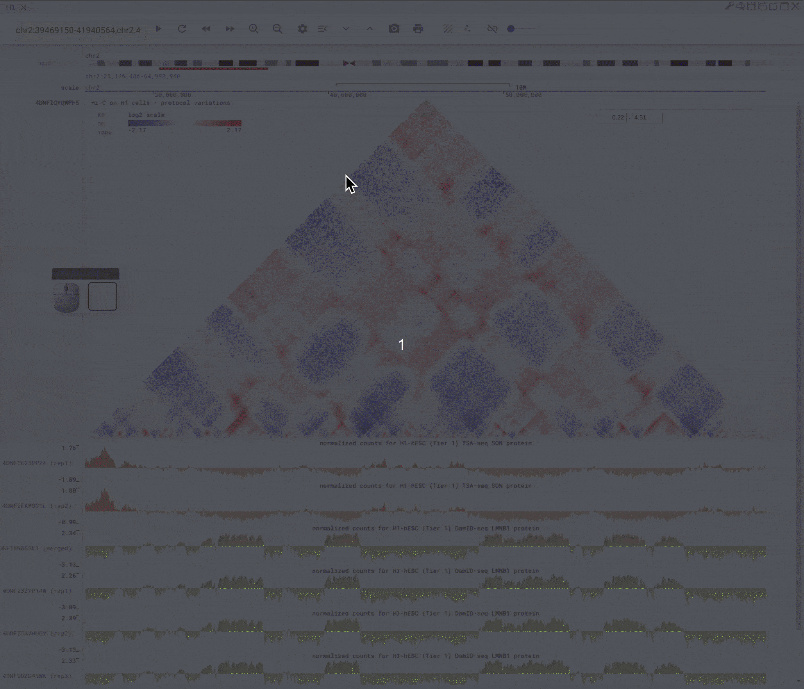
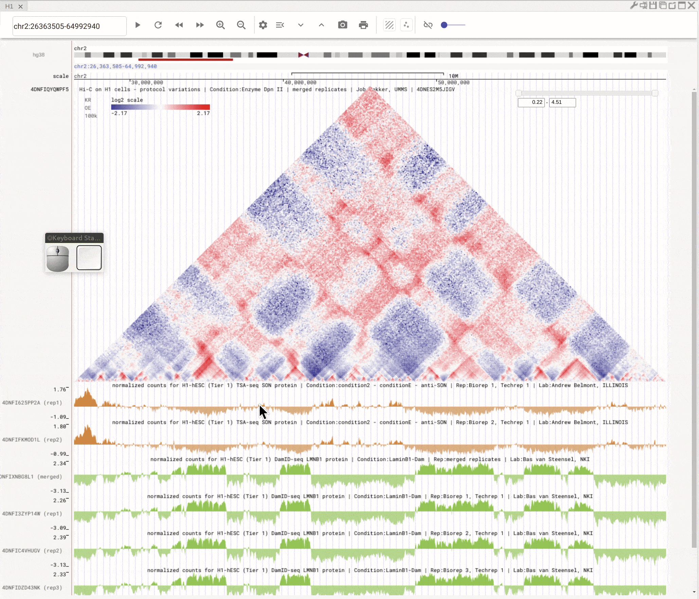
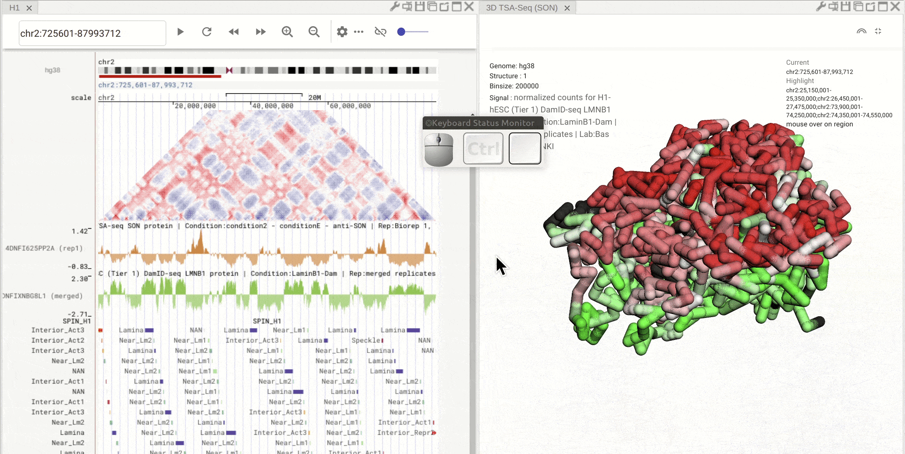
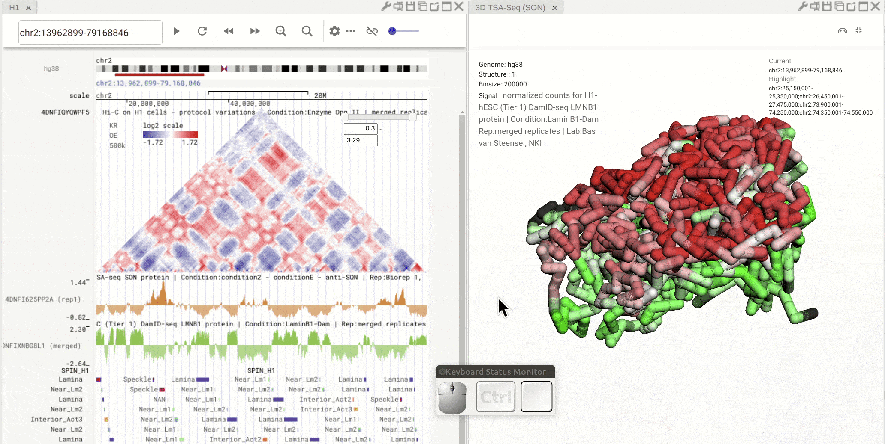

==========
Animations
==========

Overview
========

This tutorial demonstrates several unique and useful features in Nucleome Browser. Note that there are a lot of GIF files on this page. We recommend you view these examples using computers rather than cell phones. You can also view some vidoe tutorial on `Youtube <https://www.youtube.com/playlist?list=PLyp0mWOpk-buPrfuh18_Bqu1wx04VbbxD>`_.

Panel organization
===================

Create a new panel
------------------

When you mouse over the ``plus`` button (|top-plus|) in the top mwnu bar on the left, you can choose to create a new panel from the drop-down menu. You can duplicate an existing panel by clicking the ``duplication`` button (|panel-duplicate|) in the configuration toolbar located on the top-right of that panel.

.. |top-plus| image:: img/other/icon/icon-top-plus.png
    :height: 14px

.. |panel-duplicate| image:: img/other/icon/icon-panel-duplicate_v2.png
    :height: 14px

.. figure:: img/tutorial/GIF/NB_create_a_new_panel_compress.gif
    :align: center
    :figwidth: 640px

    Create a new panel

Change the layout of panels
---------------------------

Nucleome Browser supports flexibly adjusting the composition of panels. You can drag a panel to a different position of the browser tab by clicking the title of the panel, holding the mouse, and dragging it to the desired location. A grey box will appear to indicate the new layout of panels. You can then release the mouse to confirm the adjustment. Panels can also be stacked on each other if you drag a panel to another panel's title region. The mouse will turn into a re-size tool when you hover on the boundary of panels. You can then drag it to adjust either the height or the width of a panel.

.. figure:: img/tutorial/GIF/NB_flexible_layout_compress.gif
    :align: center
    :figwidth: 640px

    Nucleome Browser supports a flexible layout to arrange multiple panels

Genome browser tutorial
=======================

Navigate the genome using navigation buttons
--------------------------------------------

You can use navigation buttons to move forward/backward on the chromosome or zoom-in/-out based on the genomic coordinates.

    
    Use the navigation buttons to move along the genome

Navigate the genome using the ideogram
--------------------------------------

To quickly move to a different region on the same chromosome, you can also use the mouse to brush the ideogram of a chromosome on the top. You can further adjust the brushed region by dragging the region with the left button of the mouse and then zoom into the brushed region by right-clicking the mouse. 

.. figure:: img/tutorial/GIF/NB_navigation_ideogram_compress.gif
    :align: center
    :figwidth: 640px
    
    Brush on the ideogram for quick navigation on the chromosome

Left-click to highlight & right-click to zoom in
------------------------------------------------

Use the left button of mouse to highlight on 1D or 2D genomic tracks. You can move the highlighted region by dragging it. Use right-click to zoom-into the highlighted region(s). 

    
    Highlight on 1D or 2D genomic tracks using the left button of a mouse. Right click the highlighted region to zoom-into this region

Highlight multiple regions
--------------------------
You can click a region in the bigBed track to highlight one region. If this region has a name (defined in the fourth column of the bed file) and color (defined in the ninth column of the bed file), all the regions with the same name and color will be highlighted. Highlighted regions will synchronize across all connected panels. 

    
    Click on one region of a bed track. Other regions with the same annotation (name and color) will be highlighted

Interactive scatterplot tool
----------------------------

You can open the scatterplot analysis tool by clicking the ``scatterplot button`` (|gb-scatterplot|). Each dot represents a genomic region with X-/Y-axis representing signals from two genomic tracks. You can then use the mouse to select dots and visualize their locations on the genome browser. Highlight regions on the genomic tracks will also show as highlighted dots in the scatterplot tool.

.. |gb-scatterplot| image:: img/other/icon/icon-genome-scatterplot.png
    :height: 14px

    
    Use scatterplot tool to interactively explore genomic tracks

3D genome structure model
=========================

Panning, Rotating, and Zooming in/out on the 3D genome structure models
-----------------------------------------------------------------------

Pan: Press the **Control** key and use the left button of a mouse to move the 3D model.
Rotate: Click and hold the left button of a mouse to rotate the 3D strcuture models.
Zoom in/out: Use the center mouse wheel to zoom in or zoom out.

.. figure:: img/tutorial/GIF/NB_3D_exploration_compress.gif
    :align: center
    :figwidth: 640px
    
    Use the mouse to view a 3D genome structure model

Superimpose bigWig tack onto 3D genome structure model
------------------------------------------------------

First, open the configuration window of the genome browser panel and enable rendering colors using a bigWig track by clicking the ``color-by-bigWig button`` (|color-bigwig|) in the toolbar of a 3D genome structure model panel. Select a bigWig track from the genome browser panel and drag that track to the target box on the 3D model panel. 

.. |color-bigwig| image:: img/other/icon/icon-3d-color-bigwig.png
    :height: 14px

.. |track-send| image:: img/other/icon/icon-genome-send.png
    :height: 14px

Click a segment on the 3D structure to navigate
-----------------------------------------------

Enable clickable operation on a 3D structure model by clicking the pencil symbol on the toolbar of a 3D genome structure model panel (the button will turn darker). Left-click the mouse on the 3D structure to navigate to that region.

    
    Use the mouse to manipulate the 3D structure

Synchronized highlight between genome browser and the 3D genome structure model
-------------------------------------------------------------------------------

If you set the color mode of a 3D genome structure model panel as highlight, highlighted regions are synchronized from a genome browser panel to the 3D genome structure model panel.

    
    Use the mouse to manipulate the 3D structure

