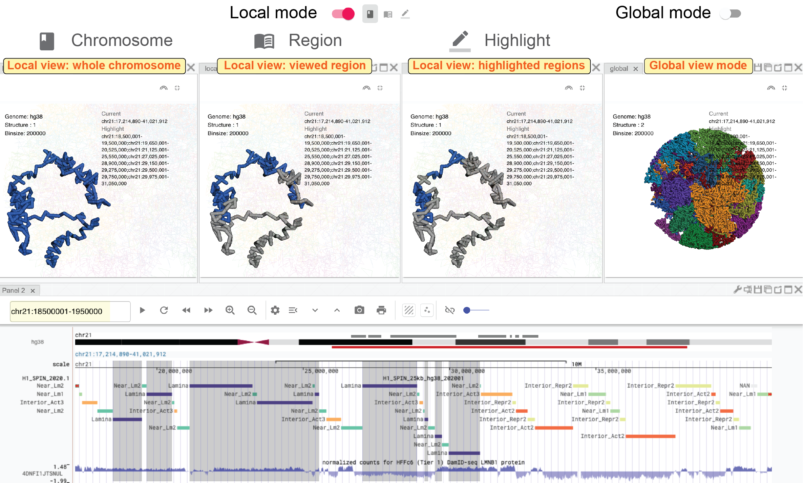
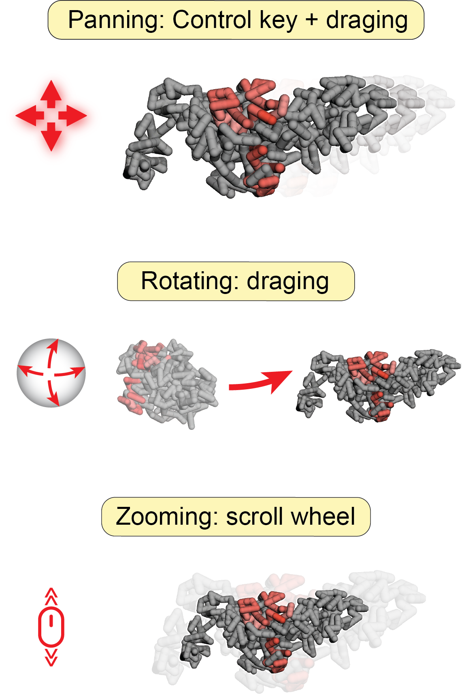

================================
3D genome structure model viewer
================================

Nucleome Browser provides a 3D genome structure model web component to visualize 3D structure data.
We created a new data format named nucle3d to store spatial information of 3D genome structure models.
The documentation of the nucle3d format can be found at `https://github.com/nucleome/nucle3d <https://github.com/nucleome/nucle3d>`_.
We also provided some scripts to convert common 3D structure model data formats such as HSS and CMM into the nucle3d format.
You can download these scripts at `https://github.com/nucleome/nucle <https://github.com/nucleome/nucle>`_.

Once the data is formatted, you can upload the data to a web server and put the link in the 3D data URI box as shown below.

.. figure:: img/figures_chapter_3/ch3_3d_toolbar.png
    :align: center
    :figwidth: 640px

    3D structure viewer toolbar

Two visualization modes
=======================

By default, DNA molecules are shown as segments with color.
Depending on the meaning of color, there are two visualization modes of 3D structures: 1) global mode showing all chromosomes; 2) local mode showing currently viewed regions.
You can switch between these two modes by toggling the mode button.

Global view mode
----------------

In the global view mode, you can see all chromosomes.
When the ``enable selection button`` is on, you can jump up a chromosome by clicking a chromosome on the 3D structure model.Other panels will navigate to that chromosome as well.

Local view mode
---------------

In the local view mode, you can further determine how to what kind of regions are displayed with color. 
There are three options: 1) currently viewed chromosome(s); 2) currently viewed region(s); 3) highlighted region(s).

    Different examples in global and local mode

Change atom style
=================

You can choose an atom style of the 3D structure by clicking the atom style buttons on the toolbar.
Currently four styles are implemented: line (|style-line|), stick (|style-stick|), cross (|style-cross|), and sphere (|style-sphere|).

.. |style-line| image:: img/other/icon/icon-3d-style-line.png
    :height: 14px

.. |style-stick| image:: img/other/icon/icon-3d-style-stick.png
    :height: 14px

.. |style-cross| image:: img/other/icon/icon-3d-style-cross.png
    :height: 14px

.. |style-sphere| image:: img/other/icon/icon-3d-style-sphere.png
    :height: 14px

.. figure:: img/figures_chapter_3/ch3_3d_atom_style.png
    :align: center
    :figwidth: 640px

    The same 3D structure viewed in four atom styles

Exploring structures
=======================

**Rotate**

Left-clicking any place in the 3D structure panel, holding the mouse, and dragging it you will see views of the 3D structure from different angles.

**Zoom-in and Zoom-out**

You can use the scroll wheel of the mouse to zoom in and zoom out the 3D structure. 

**Pan**

Holding the control key, left-clicking, and holding the mouse you can move the 3D structure.

    Users can easily manipulate 3D structures using different operations

Configure color
===============

You can also customize the color of the 3D structure using three methods: 1) by chromosome; 2) by bigWig signal; 3) by bigBed annotation.

.. figure:: img/figures_chapter_3/ch3_3d_color_config.png
    :align: center
    :figwidth: 640px
    
    Config the color of 3D structures using chromosome IDs, bigWig signal, or bigBed annotation.

By chromosomes
--------------

In this mode, different chromosomes are colored by randomly selected colors.
To turn on color by chromosome mode, you can click the ``color-by-chromosome button`` (|color-chrom|) in the 3D structure toolbar.

.. |color-chrom| image:: img/other/icon/icon-3d-color-chrom.png
    :height: 14px

By bigWig signals
-----------------

Users can super-impose a bigwig track from the genome browser panel onto the 3D genome structure.
First, you need to go to the configuration mode of the genome browser panel (see details in the genome browser web component).
Next, you need to click the ``color-by-bigWig button`` (|color-bigwig|) in the 3D structure toolbar.
Finally, by left-clicking the ``send button`` (|track-send|) and dragging one bigwig track to the target box, you will see the color of DNA segments change into a green-to-red gradient.
Here, the red color represents larger values and the green color represents lower values.

.. |color-bigwig| image:: img/other/icon/icon-3d-color-bigwig.png
    :height: 14px

.. |track-send| image:: img/other/icon/icon-genome-send.png
    :height: 14px

By bigBed annotations (experimental)
------------------------------------

It is also possible to color 3D structure by categorical annotations from a bigBed track.
Clicking the ``color by bigBed button`` (|color-bigbed|) on the 3D structure toolbar, a new box will appear allowing users you drag-and-drop bigBed track from the genome browser panel to the 3D structure panel.
The procedure is quite similar as compared to coloring the DNA using a bigWig track.
Notably, this feature may be quite slow if you are viewing a large region.
The volumes of spheres are proportional to the size of annotations and the spatial position of spheres are the average values of the corresponding DNA segments.

.. |color-bigbed| image:: img/other/icon/icon-3d-color-bigbed.png
    :height: 14px

.. figure:: img/figures_chapter_3/ch3_3d_bigwig.png
    :align: center
    :figwidth: 640px

    Super-impose bigWig/bigBed tracks onto the 3D structure

Interaction across panels
=========================

There is no limit to the number of 3D structure panels opened in the Nucleome Browser.
Users can configure each 3D panel individually by choosing different 3D data, different atom styles, different view modes, or different color settings.
Notably, when you rotate or zoom a 3D structure in one panel, other panels showing the same data will rotate or zoom to the same viewpoint.
This feature allows users to easily explore genomic signals on 3D structures.
For example, you can super-imposed different bigWig signals on different 3D structure panels (with the same structure) and compare different signals.
