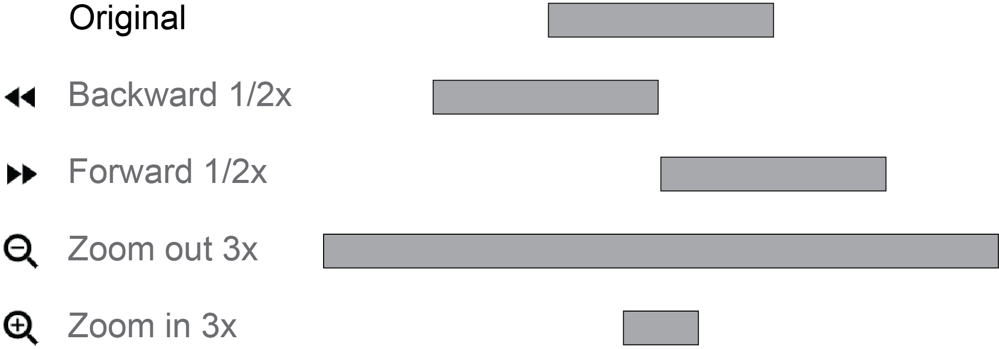
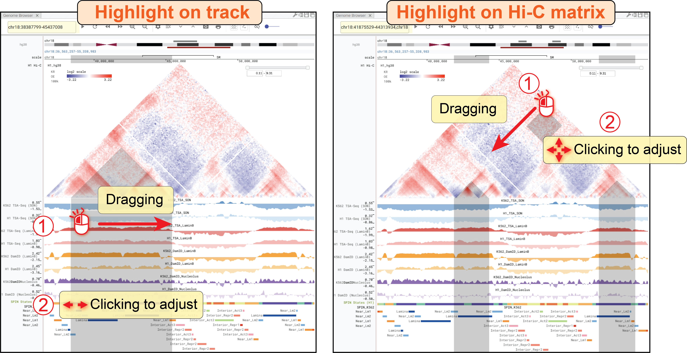
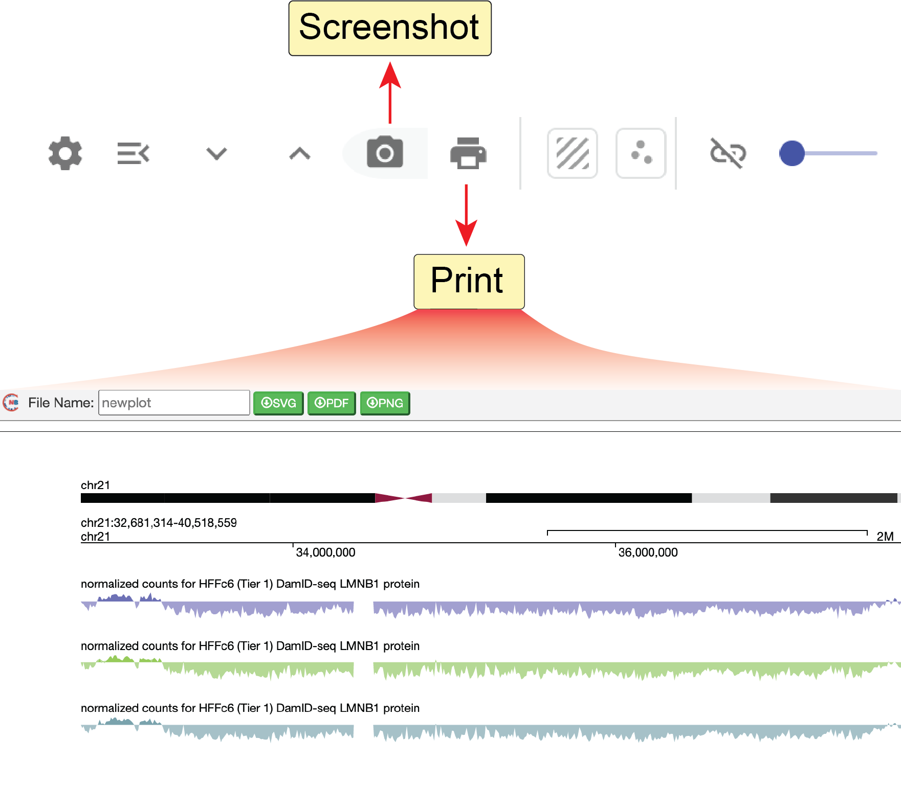

.. _components:

==============
Genome browser
==============

The genome browser web component in Nucleome Browser allows users to explore various genomic and epigenomic data in widely used formats, including bigWig, bigBed, Tabix, and .hic format.

Visualization modes
===================

:numref:`gbrowser_toolbar` summarizes the configuration buttons of the genome browser panel in the top toolbar.
In Nucleome Browser, users can open multiple genome browser panels simultaneously and customize each panel.
In particular, we developed three visualization modes to control the behaviors of synchronization across multiple panels.
Users can choose a visualization mode by clicking the ``visualization mode button`` (|gb-mode|) on the right of the genome browser toolbar.

.. figure:: img/figures_chapter_3/ch3_gbrowser_toolbar_v2.png
    :name: gbrowser_toolbar
    :align: center
    :figwidth: 640px

    Genome browser web component toolbar

Default mode
------------

A genome browser panel with the default mode (|gb-mode-normal|) will synchronize its genomic coordinates and the highlight of region-of-interest (ROI) with other panels (e.g., another genome browser panel in the default mode, or 3D genome structure model panel, etc.). 
For example, when a user navigates to or highlights a genomic region in other panels, this genome browser panel will also go to that region or show the same highlighted region. 
Conversely, any operations that happened in this web component will broadcast simultaneously to other web components. 
This mode is quite useful when you want to compare data hosted in different panels side-by-side.

Context mode
------------

``Context mode`` is quite similar to the ``Normal mode``, except that users can set a zooming factor larger than 1x (e.g., 2x, 4x, etc.).
If the zooming factor is 1x, the ``Context mode`` will be the same as the ``Default mode``.
However, when a genome browser panel has a zooming factor larger than 1x, this component will automatically zoom out by this scaling factor relative to other panels. 
For example, if other panels currently navigate to a 100kb region (e.g., chr1:10Mb-10.1Mb), a genome browser panel with an 8x zooming factor will navigate to an 800kb region (chr1:9.65Mb-10.45Mb) centered on this 100kb region. 
A light green transparent box will show up in this genome browser panel to highlight the region on which other panels are viewing.
Therefore, users can explore genomic signals at multiple scales by arranging multiple components side-by-side, one in the default mode and others in the context mode, which is particularly useful for exploring genomic data at region-of-interest and its local context simultaneously.
For example, you can use one panel to visualize the details of a ChIP-seq peak and use another panel to reveal the context of the peak region without zoom-in and zoom-out back-and-forth.

Solo mode
---------

Finally, you can turn off the synchronization of a genome browser panel by clicking the button of navigation mode until the icon becomes |gb-mode-map|.
In the ``Solo mode``, this panel will not respond to any operations triggered in other panels, and will not automatically broadcast its operations to other panels as well.
However, users can still highlight a region in this panel and clicking the ``go-to button`` (|gb-goto|) to force all other panels to jump to the highlighted region. 
This mode is useful when you want to use one panel to explore a different genomic region and compare multiple regions in differental panels.

.. |gb-mode-map| image:: img/other/icon/icon-genome-mode-map.png
    :height: 14px

.. |gb-goto| image:: img/other/icon/icon-genome-go.png
    :height: 14px

Navigate genome
===============

Type region(s) manually
-----------------------

You can navigate to a certain region(s) by manually typing the genomic coordinate(s) in the genomic coordinate box located on the left of the toolbar.
The genome browser component can recognize a genomic coordinate formatted as chromosome:start-end, such as ``chr1:1000-2000``.
Notably, it will assume the coordinates are 1-base and right-fully closed.
It is also possible to view multiple regions together.
You can visualize up to five different genomic regions using a semicolon as the separator (e.g., ``chr1:1-20000;chr2:1-30000``).
To view the entire chromosome, you can just type the name of a chromosome (e.g., ``chr1`` for viewing the whole chromosome 1, ``chr1;chr2`` for viewing chromosome 1 and chromosome 2 together).
Similarly, up to five different chromosomes can be viewed in one panel.
Nucleome Browser allows users to search for a gene by its name.
You can type the gene's name in the genomic coordinates box and choose the gene in the drop-down list.

Navigation buttons
------------------

You can use four buttons to quickly navigate along the genome. 
Clicking the ``zoom-out button`` (|gb-zoom-out|) will zoom out to a 3x length of the current region. 
Clicking the ``zoom-in button`` (|gb-zoom-in|) will zoom in to a 1/3x length of the current region. 
Clicking the ``move forward button`` (|gb-forward|) will move the currently viewing region to the right for a 1/2x length of the current region. 
Clicking the ``move backward button`` (|gb-backward|) will move the currently viewing region to the left for a 1/2x length of the current region. 
Notably, multiple regions overlapping with each other will be automatically merged when you zoom out.

.. figure:: img/figures_chapter_3/ch3_gbrowser_navigate.png
    :align: center
    :figwidth: 480px

    Use the genomic coordinate box to go to a certain region or use navigation buttons to move along the genome

    Illustration of the change of view using different navigation buttons

.. |gb-zoom-in| image:: img/other/icon/icon-genome-zoomin-3x.png
    :height: 14px

.. |gb-forward| image:: img/other/icon/icon-genome-forward.png
    :height: 14px

.. |gb-backward| image:: img/other/icon/icon-genome-backward.png
    :height: 14px

Highlight region(s)
-------------------

You can left-click the mouse and drag it on tracks to highlight a particular region.
When you drag it on the 2D matrix track, two regions will be highlighted with a highlighted rectangle on the 2D matrix. 
After you release the mouse, you can then left-click on the highlight region(s) and drag it to move it along the 1D track or 2D track.
Notably, when you highlight a region or move the highlighted region in one panel, other panels will also show the highlighted region as a transparent black block simultaneously.
This synchronization also works when you highlight multiple regions.

    Right-click the mouse to zoom into any highlighted 1D and 2D track

Right-clicking any place on the highlighted region, you will zoom into that region.
If a bed track shows categorical data with different colors (e.g., SPIN states, Hi-C subcomponents), you can highlight all the regions with the same annotation/color by left-clicking one region.
Right-clicking on these highlighted regions, a zoom-in view of the highlighted regions will appear. 
Notably, multiple regions separated from each other on the genome will be stitched as shown below. 

.. figure:: img/figures_chapter_3/ch3_gbrowser_multiregion.png
    :align: center
    :figwidth: 640px

    If multiple regions are highlighted, right-clicking those regions will zoom into regions by stitching discontiguous regions together.

Use chromosome ideogram
-----------------------

Chromosome ideogram shows an overview of a chromosome.
The currently viewed region is shown as a red bar just below the chromosome ideogram. 
You can left-click the red bar and drag it to quickly navigate to another region in the same chromosome.
You can also brush on the chromosome ideogram to highlight a region and right-click the highlighted region to zoom into that region. 

.. figure:: img/figures_chapter_3/ch3_gbrowser_ideogram.png
    :align: center
    :figwidth: 480px

    Navigate the genome using the chromosome ideogram

Export browser view
===================

Export screenshot
-----------------

A save-to-png button (|gb-screenshot|) can directly export the screenshot of the current panel into a png image file.
You can also create a high-quality image of the current genome browser's view including the highlights using the print button (|gb-print|) in the genome browser toolbar. 
You can choose a file format for the downloaded image from pixel-based graphics (png format) and vector-based graphics (SVG, pdf). 
Vector-based graphics can be further edited for publication using the edit tool provided on the Nucleome Browser or commercial software such as Adobe Illustrator.
Notably, the print function can only save the current panel into an image file. 
You need to save views for different genome browser panels one by one.

    Print the current view to png or SVG file

.. |gb-screenshot| image:: img/other/icon/icon-genome-screenshot.png
    :height: 14px

.. |gb-print| image:: img/other/icon/icon-genome-print.png
    :height: 14px

Remove guidelines
-----------------

Clicking the ``remove guidelines button`` (|gb-guideline|), you can remove the vertical blue lines.

.. |gb-guideline| image:: img/other/icon/icon-genome-guideline.png
    :height: 14px

.. figure:: img/figures_chapter_3/ch3_gbrowser_guide_line.png
    :align: center
    :figwidth: 480px
    
    Remove guidelines on the background 

Configure tracks
================

Configure a single track
------------------------

Right-clicking on one track label on the left, and choosing the ``config button`` from the drop-down list, you will see the configuration dialog. 
You can then customize the appearance of a track by modifying the configuration. 
Some explanations of settings are shown below:

- **alias**: Set an alternate label for this track, which will be shown on the left of the track.
- **color**: Select the primary color for a track.
- **height**: Set track's height (bigWig only).
- **mode**: Choose a display mode for a bigWig or bigBed track from ``full`` and ``dense``.
- **autoscale**: Whether to automatically scale the min and max value for the bigWig track.
- **max**: When ``autoscale`` is off, set the upper limit of the bigWig track.
- **min**: When ``autoscale`` is off, set the lower limit of the bigWig track.
- **norm**: Select normalization method for .hic matrix.
- **oe**: Whether to display observed vs expected (O/E) contact matrix rather than observed matrix for .hic data.
- **min_bp**: Set the minimum resolution for a Hi-C contact matrix.

.. figure:: img/figures_chapter_3/ch3_gbrowser_track_config.png
    :align: center
    :figwidth: 640px

    Configure a single track.
    
To hide a track, you can right-click on the track label and click the ``hide button`` from the drop-down list. 
To re-order a track, you can drag that track and move it up or down to a preferred location. 

Batch-configuration tool
------------------------

You can also configure a series of tracks together using the batch-configuration tool.
Clicking the ``batch-configuration button`` (|gb-batch-config|) in the genome browser panel toolbar, you will see the dialog of the batch-configuration tool.
In this tool, you can select multiple tracks (holding the ``Control`` key to add a track one-by-one or the ``Shift`` key to select a range of tracks) and then modify their appearance at the same time.
Notably, the batch-configuration tool only works for bigWig tracks.
This tool is quite useful to convert a large number of tracks into the dense mode or set the same color for those tracks.

.. figure:: img/figures_chapter_3/ch3_gbrowser_bigwig_batch.png
    :align: center
    :figwidth: 640px

    Batch configure multiple bigWig tracks

.. |gb-batch-config| image:: img/other/icon/icon-genome-batch.png
    :height: 14px

We also provide two buttons to directly convert all bigwig tracks from the full view to a compact view and vice versa.
You can access these buttons in the toolbar of the genome browser web component. 

.. figure:: img/figures_chapter_3/ch3_gbrowser_bigwig_full_compact.png
    :align: center
    :figwidth: 640px

Manage tracks
=============

Clicking the ``configuration button`` (|gb-config|) on the toolbar of the genome browser panel, you will see a configuration dialog box.
You can also click the ``panel-configuration button`` (|panel-config|) on the top-right of the panel to view the configuration dialog box.
In the configuration dialog page, you will see three parts: 1) a data service module on the top; 2) currently loaded tracks shown on the left;  and 3) available tracks from data service on the right.

In the data service module, you can add data service to the existing list of genomic data services.

In the currently loaded track module, you can quickly re-order tracks by dragging a track, view meta-information for a track, and super-impose a track on a 3D genome structure model (see the 3D genome structure model web component).

In the available tracks module, you can select a datasheet and add tracks to the list of loaded tracks. 
You can filter tracks by clicking the ``search button`` and using keywords to search tracks. 
Clicking the ``read-more button``, you will be directed to a new website showing extra information about this track (for 4DN data, it leads to the meta-information web page on the DCIC data portal).

.. figure:: img/figures_chapter_3/ch3_gbrowser_config.png
    :align: center
    :figwidth: 640px

    Add or remove tracks in the configuration interface of the genome browser component

.. |gb-config| image:: img/other/icon/icon-genome-config.png
    :height: 14px

.. |panel-config| image:: img/other/icon/icon-panel-config_v2.png
    :height: 14px

Scatterplot analysis tool
=========================

Nucleome Browser provides an interactive scatterplot analysis tool to quantatively compare signals between two bigWig tracks. 
Clicking the ``scatterplot button`` (|gb-scatterplot|), a box will appear on the right side of the genome browser panel.  
After you select which tracks to be shown in the X-axis and Y-axis, an interactive scatterplot will appear.
In this scatterplot, each dot indicates a genomic bin (the size of the genomic bin will be automatically adjusted based on the size of the currently viewed region). 
Notably, if you highlight regions on genomic tracks, corresponding dots will also be highlighted with a different color in the scatterplot.
When you drag the highlighted region, highlighted dots will automatically update.
Conversely, when you use the rectangle or lasso selection tool to manually select a set of dots on the scatterplot, those regions will be highlighted on the tracks as well. 

This tool is quite useful to facilitate researchers to discover interesting regions showing an unexpected relationship between two signals.
For other functions of the scatterplot tool such as pan, zoom, reset, etc., you can view the documentation on the Plotly website (`https://plotly.com <https://plotly.com>`_).

.. figure:: img/figures_chapter_3/ch3_gbrowser_scatterplot_v2.png
    :align: center
    :figwidth: 640px

    Use the scatterplot tool to explore the relationship between two bigWig tracks

.. |gb-scatterplot| image:: img/other/icon/icon-genome-scatterplot.png
    :height: 14px

