.. _components:

===================
Web component types
===================

Nucleome browser supports a series of composable, configurable, and communicable web components, including a genome browser web component designed for presenting both 1D and 2D genomic data, a 3D structure web component, a web component specifically designed to view imaging data stored from the 4DN DCIC data portal, a region-of-interest web component to explore a list of user-defined regions, a DNA sequence web component to fetch DNA sequence, and customized web applications supporting various custom data formats.

Genome browser
==============

Genome browser web component works as conventional genome browsers such as the UCSC Genome Browser, providing visualization support for commonly used genomic data including bigWig, bigBed, tabix, and .hic format.

Three visualization modes
-------------------------

:numref:`gbrowser_toolbar` summarizes the configuration buttons of the genome browser panel in the top toolbar.
Notably, since the Nucleome Browser supports synchronization across multiple panels, two additional navigation modes are introduced in the genome browser web components, i.e., ``Map`` mode and ``Context`` mode.
Users can choose a visualization mode by clicking the ``visualization mode button`` (|gb-mode|) on the right of the genome browser toolbar.

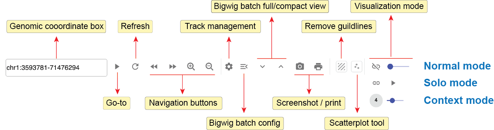

    Genome browser web component toolbar

**Normal mode**: 

If a genome browser web component is in the normal mode (|gb-mode-normal|), it will automatically update itself according to operations dispatched from other web components (for genome browser component they must also be in normal or context mode). 
For example, when a user navigates to or highlights a genomic region in other web components, this genome browser component will also go to that region or show the same highlighted region. 
Conversely, any operations happened in this component will broadcast simultaneously to other components. 
This mode is quite useful when you want to compare data hosted in different panels side-by-side.

**Context mode**: 

``Context mode`` is quite similar to the ``Normal mode``, except that users can set a zooming factor larger than 1x (e.g., 2x, 4x, etc.).
If the zooming factor is 1x, the ``Context mode`` will act the same as the ``Normal mode``.
However, when a genome browser component has a zooming factor larger than 1x, this component will automatically zooming-out by this scale factor relative to other components. 
For example, if other panels currently navigate to a 100kb region (e.g., chr1:10Mb-10.1Mb), a genome component with an 8x zooming factor will navigate to the 800kb region (chr1:9.65Mb-10.45Mb) centered on this 100kb region. 
To help users view the relationship between the default region and zoomed-out region, a light green transparent box will be shown in this genome browser to highlight the region on which other panels are viewing at.
This mode is quite useful when you want to capture the big-picture of a region-of-interest. 
For example, you can use one panel to visualize the details of a ChIP-seq peak and use another panel to reveal the context of the peak region without zoom-in and zoom-out back-and-forth.

**Map mode**:

Finally, you can turn off the synchronization of a genome browser component by clicking the button of navigation mode until the icon becomes |gb-mode-map|.
In the ``Map mode``, this panel will not respond to any operations that happened in other panels, and will also not automatically broadcast its operations to other panels. 
However, users can still highlight a region in this panel and clicking the ``go-to button`` (|gb-goto|) to force all other panels to go to the highlighted region. 
This mode is useful when you want to use one panel to view the big picture and examine details in other panels. 

.. |gb-goto| image:: img/other/icon/icon-genome-go.png
    :height: 14px

Navigate genome
---------------

**Type region(s) manually**

You can navigate to a certain region(s) by manually typing the genomic coordinate(s) in the genomic coordinate box located on the left of the toolbar.
The genome browser component can recognize any  genomic coordinate formatted as chromosome:start-end, such as ``chr1:1000-2000``.
Notably, it will assume the coordinates are 1-base and right-fully closed.
It is also possible to view multiple regions together.
Currently, you can type in at most five different genomic regions using a semicolon as the separator (e.g., ``chr1:1-20000;chr2:1-30000``).
To view the entire chromosome, you can just type the name of a chromosome (e.g., ``chr1`` for viewing the whole chromosome 1, ``chr1;chr2`` for viewing chromosome 1 and chromosome 2 together).
Similarly, at most five different chromosomes can be viewed at the same time.
Nucleome Browser allows users to search for a gene by its name (requiring the gene annotation track).
You can type the gene's name in the genomic coordinates box and choose the gene in the drop-down list.

**Navigation buttons**

You can use four buttons to quickly navigate through the genome. 
Clicking the ``zoom-out button`` (|gb-zoom-out|) will zoom out to a 3x length of the current region. 
Clicking the ``zoom-in button`` (|gb-zoom-in|) will zoom in to a 1/3x length of the current region. 
Clicking the ``move forward button`` (|gb-forward|) will move the currently viewing region to the right for a 1/2x length of the current region. 
Clicking the ``move backward button`` (|gb-backward|) will move the currently viewing region to the left for a 1/2x length of the current region. 
Notably, multiple regions overlapping with each other will be automatically merged when you zoom out.

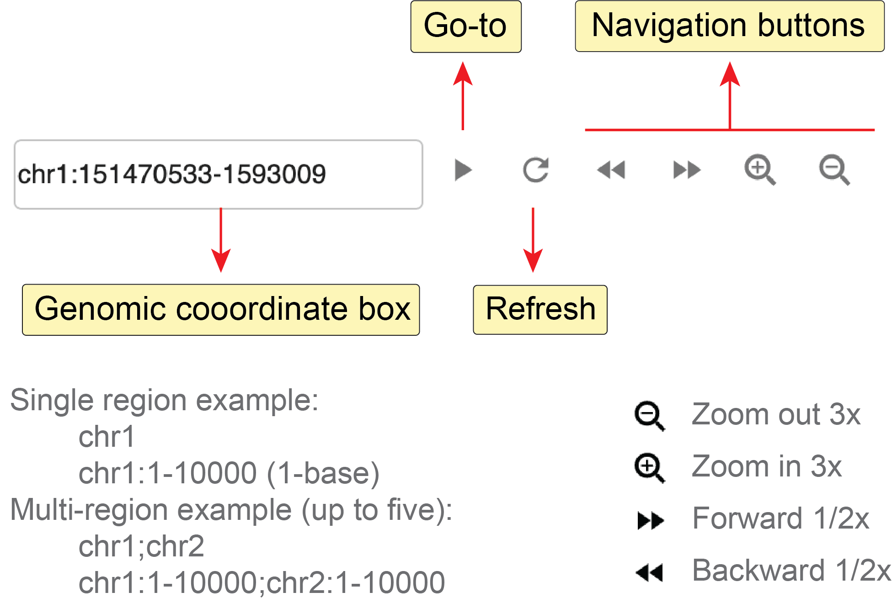

    Use genomic coordinate box to goto a certain region or use the navigation buttons to move along the genome and zoom-in/-out

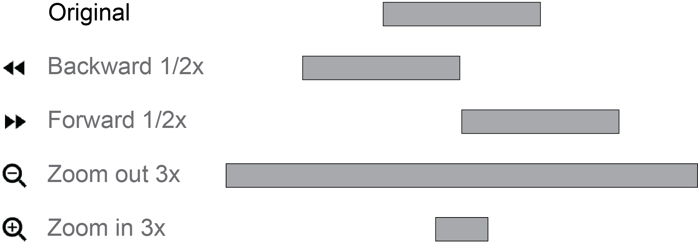

    Illustration of the change of view using different navigation buttons

**Highlight region(s)**

You can left-click the mouse and drag it on tracks to highlight a particular region.
When you drag it on the Hi-C 2D matrix track, two regions will be highlighted.
After you release the mouse, you can then left-click on the highlight region(s) and drag it to move it along the genome.
Notably, when you highlight a region or move the highlighted region in one panel, other panels will also show the highlighted region as a transparent block simultaneously.
This synchronization also works for highlights on multiple regions.

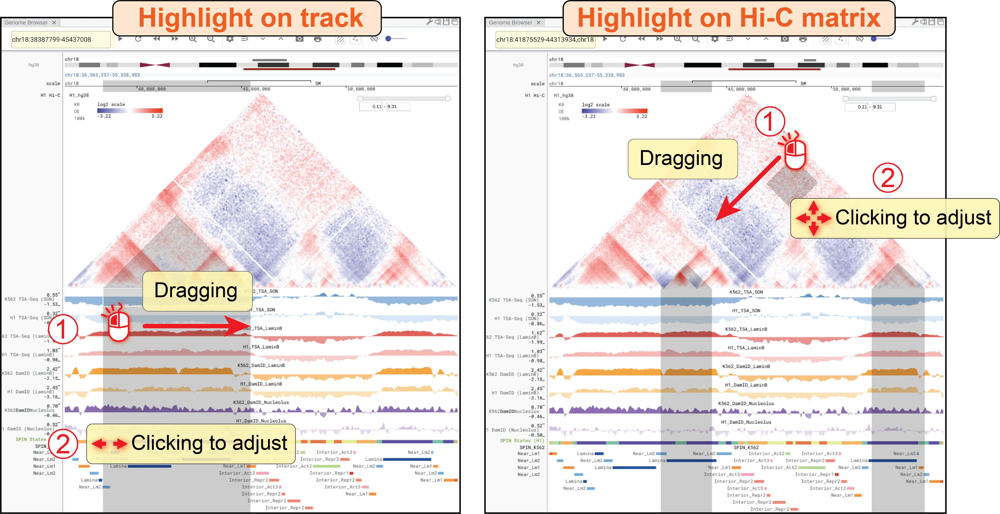

    Right-click the mouse to zoom into any highlighted track or Hi-C contact matrix

Right-clicking any place on the highlighted region, you will zoom into the region of highlight.
If a bed track shows categorical data with different colors (e.g., SPIN states, Hi-C subcomponents), you can highlight all the regions with the same annotation/color by left-clicking one region.
Right-clicking on these highlighted regions, a zoom-in view of the highlighted regions will appear. 
Notably, multiple regions separated from each other on the genome will be pseudo-merged together as shown below. 

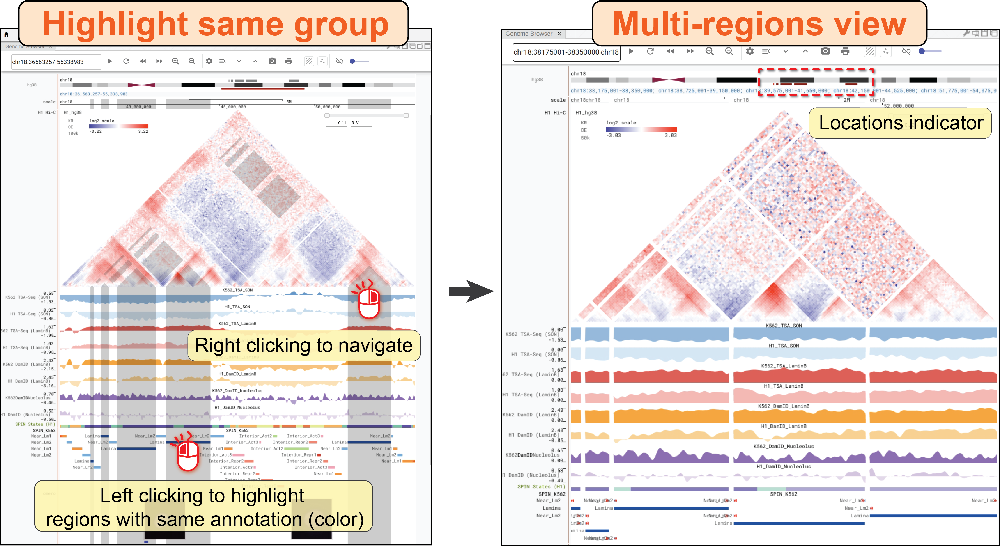

    If multiple regions are highlighted, right-clicking those region will zoom into regions by stitching discontiguous regions together.

**Use chromosome ideogram**

Chromosome ideogram shows an overview of a chromosome.
The currently viewed region is shown as a red bar just below the chromosome ideogram. 
You can left-click the red bar and drag it to quickly navigate to another region in the same chromosome.
You can also brush on the chromosome ideogram to highlight a region and right-click the highlighted region to zoom into that region. 

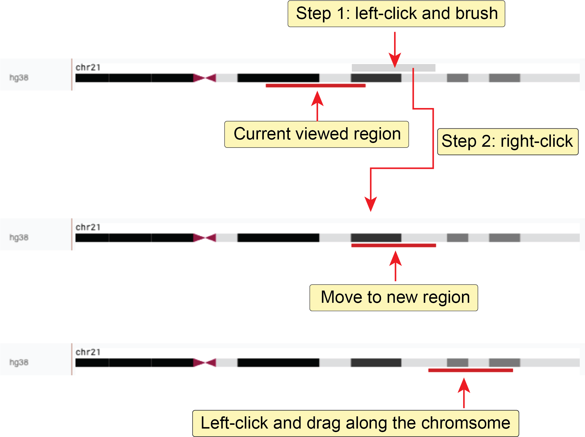

    Navigate the genome using the chromosome ideogram

Print genome browser's view
---------------------------

A save-to-png button (|gb-screenshot|) can directly export the screenshot of the current panel into a png image file.
You can also create a high-quality image of the current genome browser's view including the highlights using the print button (|gb-print|) in the genome browser toolbar. 
You can choose a file format for the downloaded image from pixel-based graphics (png format) and vector-based graphics (SVG, pdf). 
Vector-based graphics can be further edited for publication using software such as Adobe Illustrator.
Notably, the print function can only save the current panel into an image file. 
You need to save views for different genome browser panels one-by-one.

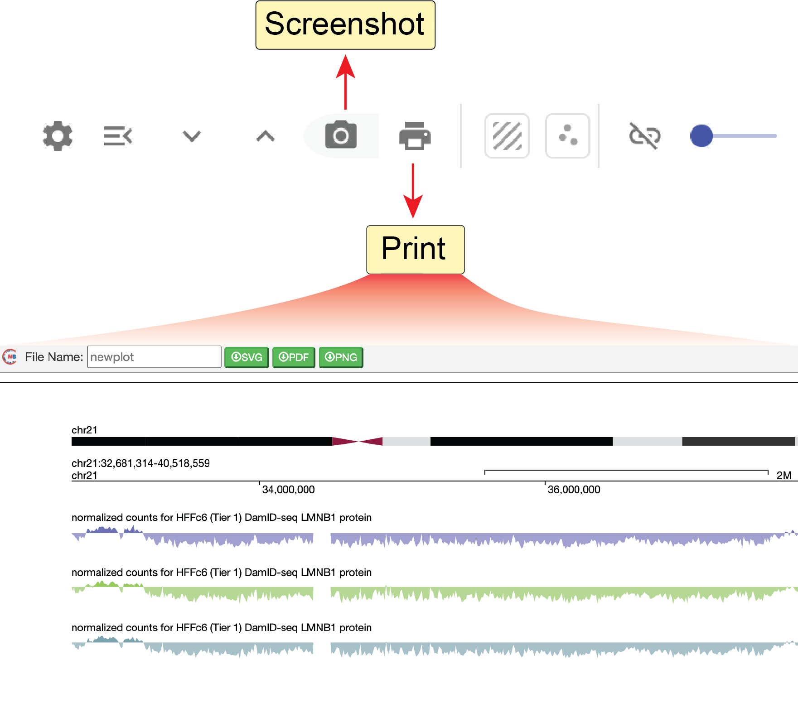

    Print the current view to png or SVG file

Configure tracks
----------------

**Configure a single track**

Right-clicking on one track label on the left, and choosing the ``config button`` from the drop-down list, you will see the configuration dialog. 
You can then customize the appearance of a track by modifying the configuration. 
Some explanations of settings are shown below:

- **alias**: Set an alternate label for this track, which will be shown on the left of the track.
- **color**: Select the primary color for a track.
- **height**: Set track's height (bigWig only).
- **mode**: Choose a display mode for a bigWig or bigBed track from ``full`` and ``dense``.
- **autoscale**: Whether to automatically scale the min and max value for the bigWig track.
- **max**: When ``autoscale`` is off, set the upper limit of the bigWig track.
- **min**: When ``autoscale`` is off, set the lower limit of the bigWig track.
- **norm**: Select normalization method for .hic matrix.
- **oe**: Whether to display observed vs expected (O/E) contact matrix rather than observed matrix for .hic data.
- **min_bp**: Set the minimum resolution for a Hi-C contact matrix.

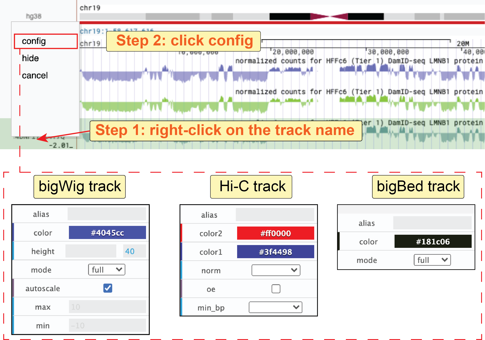

    Configure a single track
    
To hide a track, you can right-click on the track label and click the ``hide button`` from the drop-down list. 
To re-order a track, you can drag that track and move it up or down to the preferred location. 

**Batch-configuration tool**

You can also configure a series of tracks together using the batch-configuration tool.
Clicking the ``batch-configuration button`` (|gb-batch-config|) in the genome browser panel toolbar, you will see the dialog of the batch-configuration tool.
In this tool, you can select multiple tracks (holding the ``Control`` key to add a track one-by-one or the ``Shift`` key to select a range of tracks) and modify their appearance at the same time.
Notably, only bigWig tracks are supported in this tool.
This tool is quite useful to convert a large number of tracks into the dense mode or set the same color for those tracks.

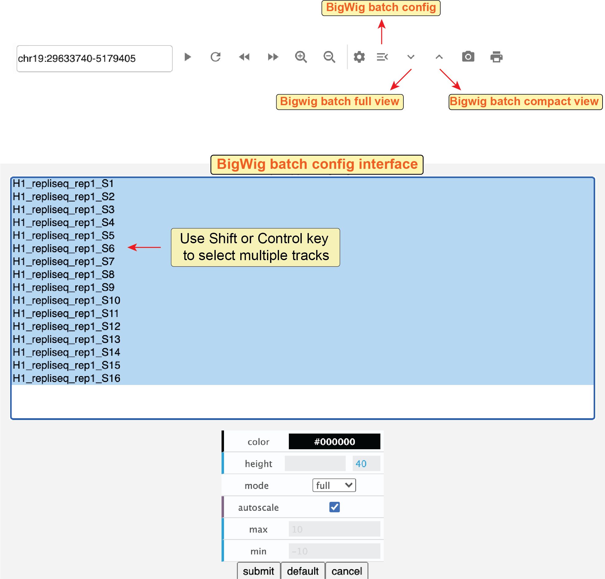

    Batch configure multiple bigWig tracks

We also provide two buttons to directly convert all bigwig tracks from the full view to a compact view and vice versa.
You can access these buttons in the toolbar of the genome browser web component. 

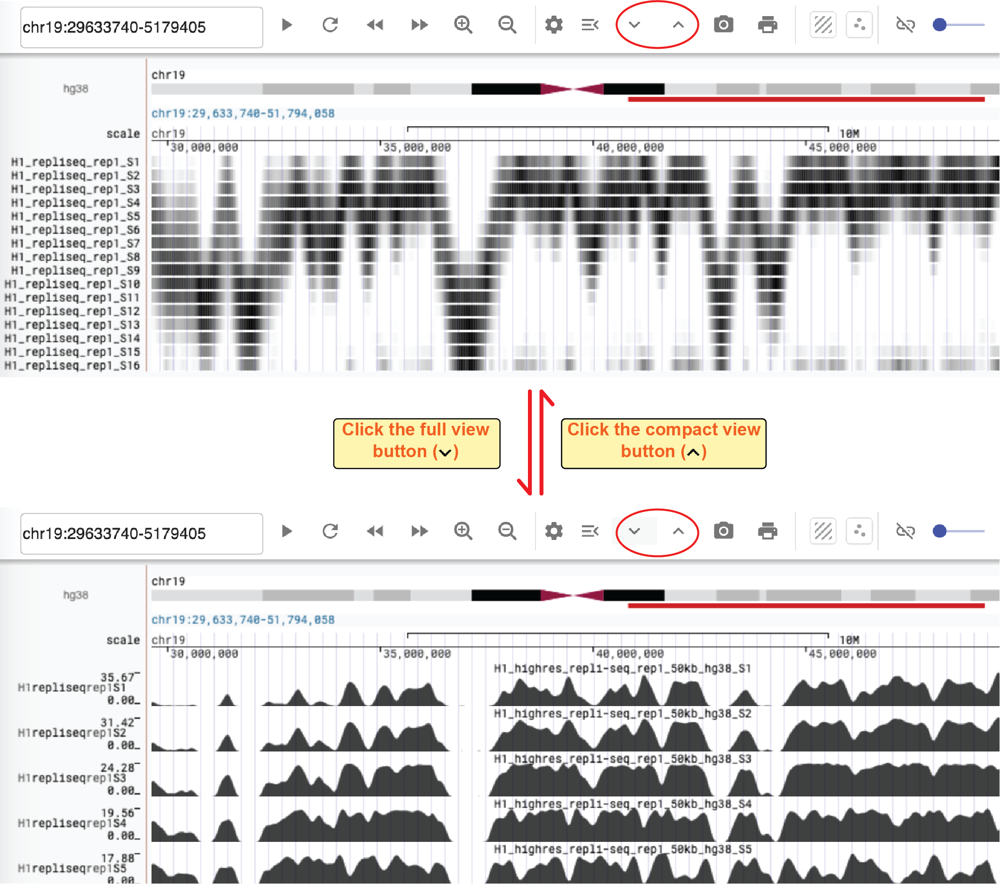

Manage tracks
-------------

Clicking the ``configuration button`` (|gb-config|) on the toolbar of the genome browser panel, you will see the configuration interface.
You can also click the ``panel-configuration button`` (|panel-config|) on the top-right of the panel to enter the configuration interface.
In the configuration interface, you will see the web page is separated into three parts: 1) data service module on the top; 2) currently loaded tracks shown on the left; 3) available tracks from data service on the right.

In the data service module, you can add data service to the existing list of genomic data services.

In the currently loaded track module, you can quickly re-order tracks by dragging a track, view meta-information for a track, and super-impose a track on a 3D structure (see the 3D structure web component below).

In the available tracks module, you can select a datasheet and add tracks to the list of loaded tracks. 
You can filter tracks by clicking the ``search button`` and type in the keywords. 
Clicking the ``read-more button``, you will be directed to a new website showing extra information about this track (for 4DN data, this leads to the meta-information website on the DCIC data portal).

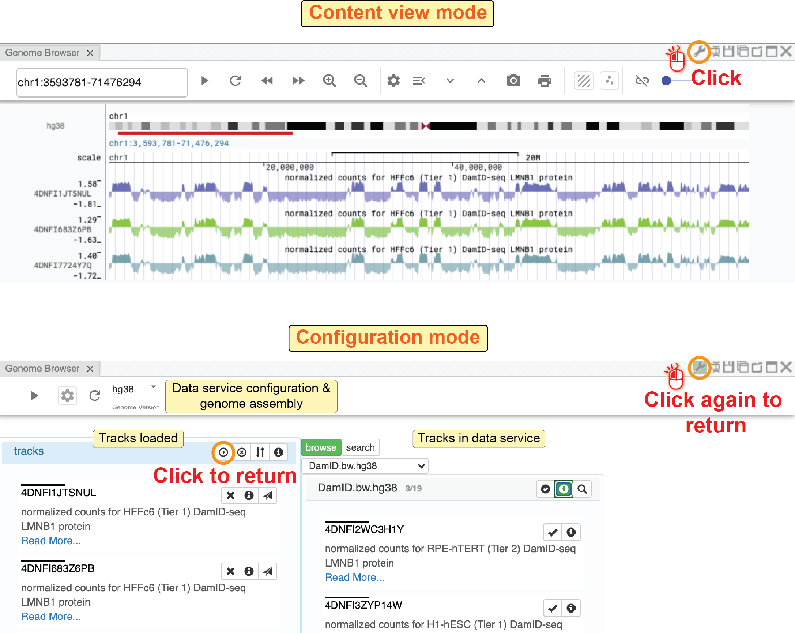

    Add or remove tracks in the configuration interface of the genome browser component

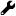

Remove guidelines
-----------------

Clicking the ``remove guidelines button`` (|gb-guideline|), you can remove the vertical blue lines .

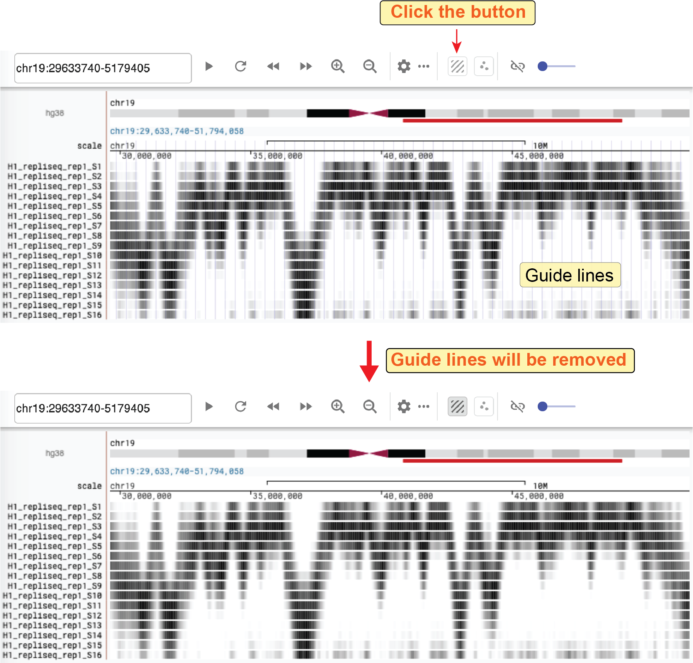
    
    Remove guide lines on the background 

Scatterplot tool
----------------

Nucleome Browser provides a convenient scatterplot tool to interactively compare signals between two bigWig tracks. 
Clicking the ``scatterplot button`` (|gb-scatterplot|), a window will appear on the right side of the genome browser panel.  
After you select which tracks to be shown in the X-axis and Y-axis, an interactive scatterplot will be shown.
In this scatterplot, each dot indicates a genomic bin (the size of the genomic bin will be automatically adjusted based on the size of the currently viewed region). 
Notably, if you highlight regions on genomic tracks or the ideogram of a chromosome, corresponding dots will also be highlighted (by a different color) in the scatterplot.
When you drag the highlighted region, highlighted dots will automatically update.
Conversely, when you use the rectangle or lasso selection tool to manually select a set of dots on the scatterplot, those regions will be highlighted on the tracks as well. 

This tool is quite useful to facilitate researchers to discover interesting regions showing unexpected a relationship between two signals.
For other functions of the scatterplot tool such as pan, zoom, reset, etc., you can view the documentation on the plotly website (`https://plotly.com <https://plotly.com>`_).

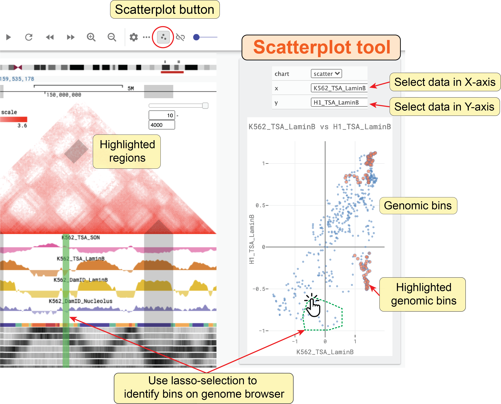

    Use the scatterplot tool to explore relationship between two bigWig tracks

.. |gb-scatterplot| image:: img/other/icon/icon-genome-scatterplot.png
    :height: 14px

3D structure viewer
===================

Nucleome Browser provides a 3D genome structure web component to visualize 3D structure data.
3D structure data is stored as a custom format called Nucle3d.
The documentation of the Nucle3d format can be accessed at `https://github.com/nucleome/nucle3d <https://github.com/nucleome/nucle3d>`_.
We also provided some scripts to convert common 3D structural data formats such as HSS and CMM into the Nucle3d format.
You can download these scripts at `https://github.com/nucleome/nucle <https://github.com/nucleome/nucle>`_.

Once the data is formated, you can upload the data to a web server and put the link in the 3D data URI box as shown below.

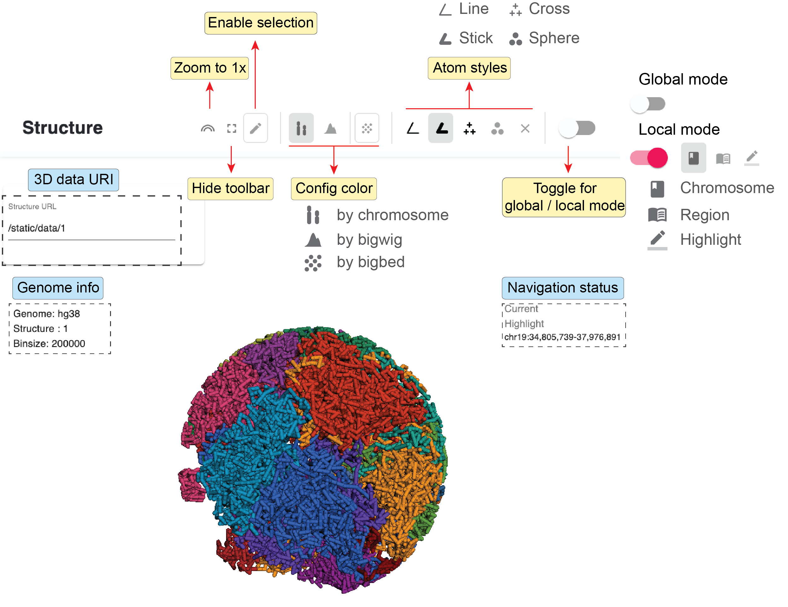

    3D structure viewer toolbar

Two visualization modes
-----------------------

By default, DNA molecules are shown as segments with color.
Depending on the meaning of color, there are two visualization modes of 3D structures: 1) global mode showing all chromosomes; 2) local mode showing currently viewed regions.
You can switch from these two modes by toggling the mode button.

**Global view mode**

In the global view mode, you can see all chromosomes.
When the ``enable selection button`` is on, you can control the currently viewed chromosome on other panels by clicking on chromosome on the 3D structure.

**Local view mode**
In the local view mode, you can set what kind of scale of the currently viewed region.
There are three options: 1) currently viewed chromosome(s); 2) currently viewed region(s); 3) highlighted region(s).

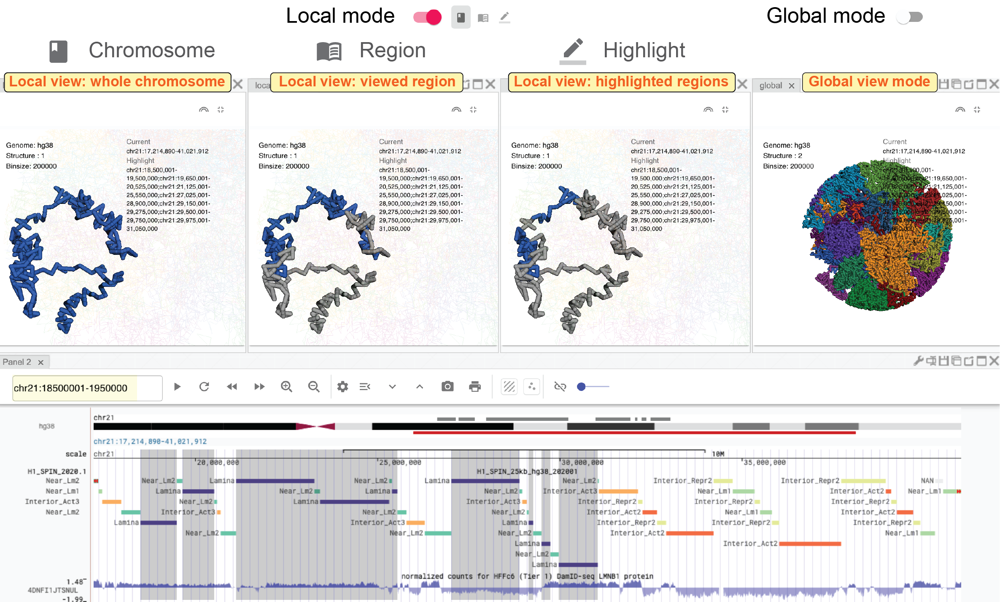

    Different examples in global and local mode

Change atom style
-----------------

You can choose a atom style of 3D structure by clicking the atom style buttons on the toolbar.
Currently four styles are implemented: line (|style-line|), stick (|style-stick|), cross (|style-cross|), and sphere (|style-sphere|).

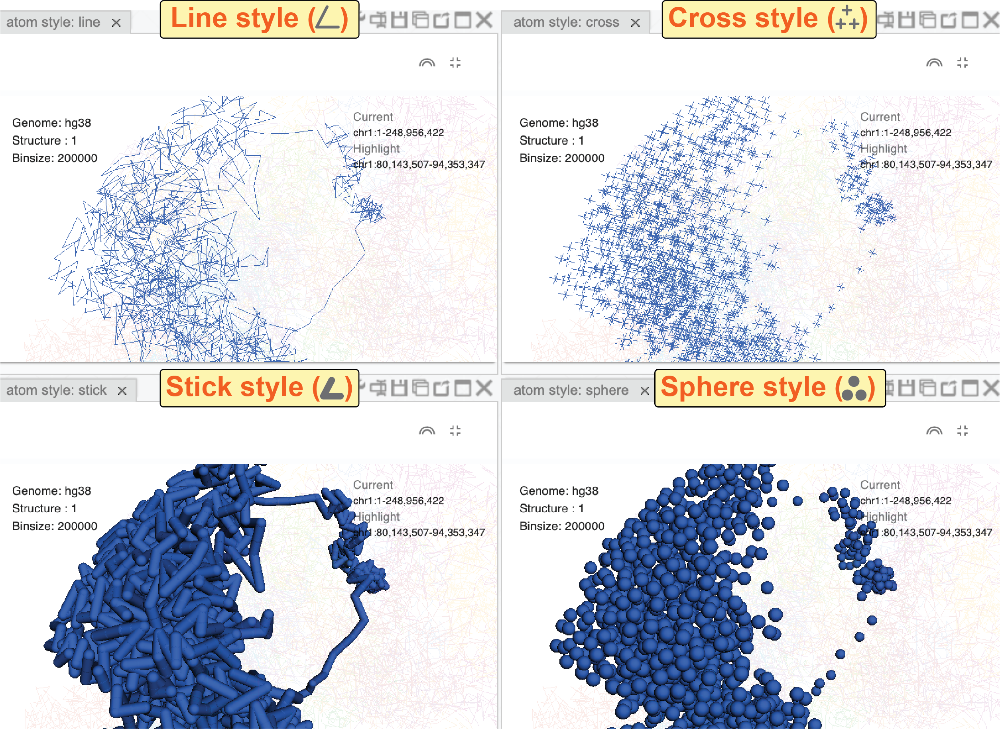

    The same 3D structure viewed in four atom styles

Exploring 3D structures
-----------------------

**Rotate**

Left-clicking any place in the 3D structure panel, holding the mouse and dragging it you will see views of the 3D structure from different angles.

**Zoom-in and Zoom-out**

You can use the scroll wheel of the mouse to zoom-in and zoom-out the 3D structure. 

**Pan**

Holding the control key, left-clicking and holding the mouse you can move the 3D structure.

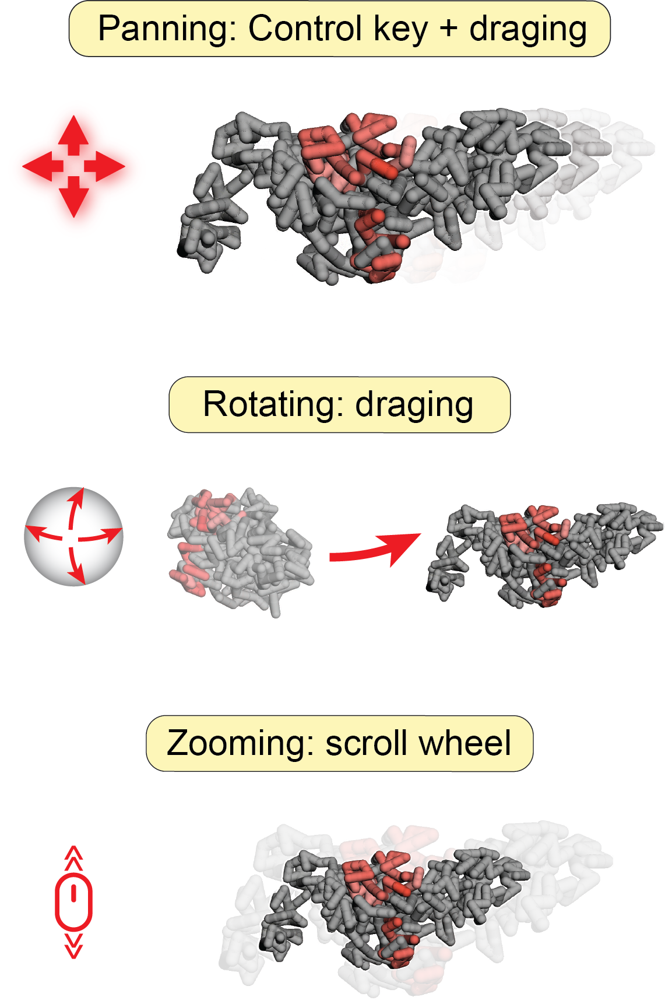

    Users can easily manipulate 3D structures using different operations

Configure color
---------------

You can also customize the color of 3D structure using three methods: 1) by chromosome; 2) by bigWig signal; 3) by bigBed annotation.

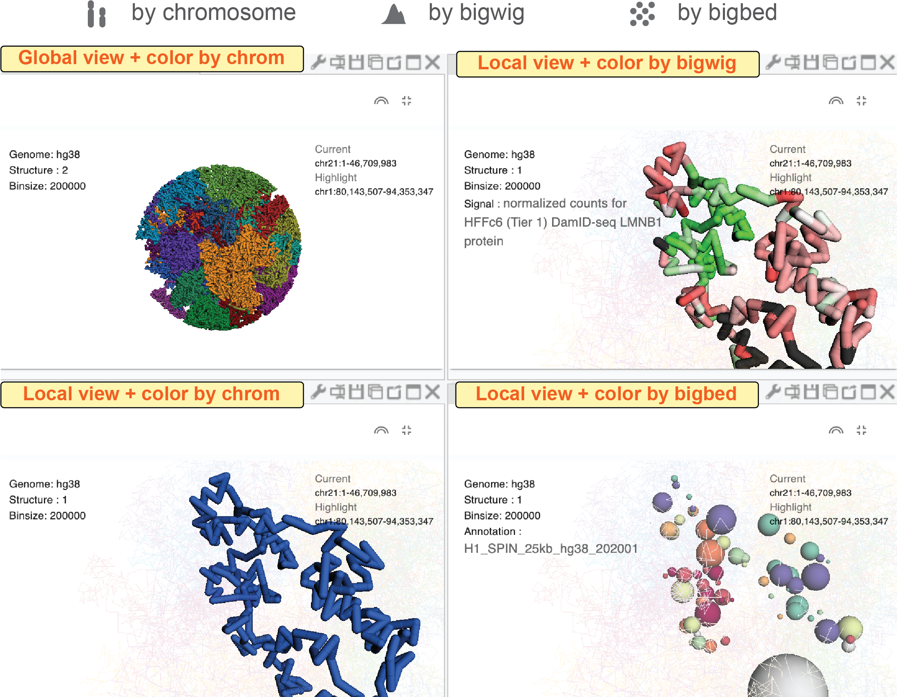
    
    Config the color of 3D structures using chromosome IDs, bigWig signal, or bigBed annotatin.

**By chromosomes**

In this mode, different chromosomes are colored by randomly selected colors.
To turn on color by chromosome mode, you can click the ``color-by-chromosome button`` (|color-chrom|) in the 3D structure toolbar.

**By bigWig signals**

Users can super-impose a bigwig track from the genome browser panel onto the 3D genome structure.
First, you need to go to the configuration mode of the genome browser panel (see details in the genome browser web component).
Next, you need to click the ``color-by-bigWig button`` (|color-bigwig|) in the 3D structure toolbar.
Finally, left-clicking the ``send button`` (|track-send|) and dragging one bigwig track to the target box, you will see the color of DNA segments change into a green-to-red gradient.
Here, the red color represents larger values and the green color represents lower values.

.. |color-bigwig| image:: img/other/icon/icon-3d-color-bigwig.png
    :height: 14px

.. |track-send| image:: img/other/icon/icon-genome-send.png
    :height: 14px

**By bigBed annotations (experimental)**

It is also possible to color 3D structure by categorical annotations from a bigBed track.
Clicking the ``color by bigBed button`` (|color-bigbed|) on the 3D structure toolbar, a new box will appear allowing users you drag-and-drop bigBed track from the genome browser panel to the 3D structure panel.
The procedure is quite similar as compared to coloring the DNA using a bigWig track.
Notably, this feature may be quite slow if you are viewing a large region.
The volumes of spheres are proportional to the size of annotations and the spatial position of spheres are the average values of the corresponding DNA segments.

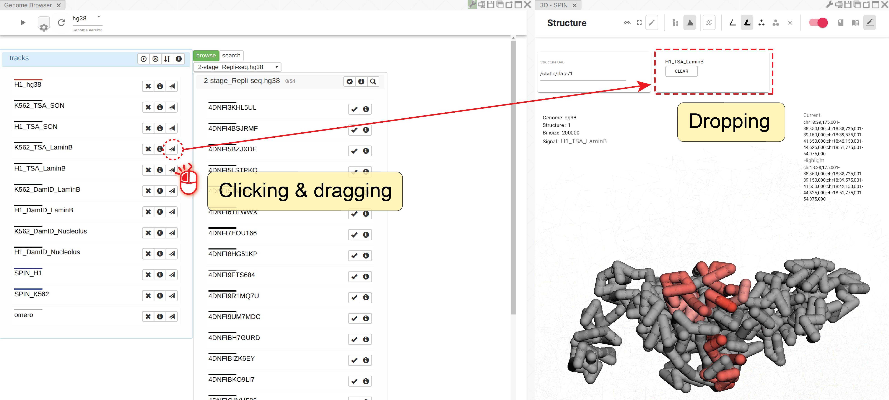

    Super-impose bigWig/bigBed tracks onto the 3D structure

Interaction across panels
-------------------------

There is no limit to the number of 3D structure panels opened in the Nucleome Browser.
Users can configure each 3D panel individually by choosing different 3D data, different atom styles, different view modes, or different color settings.
Notably, when you rotate or zoom a 3D structure in one panel, other panels showing the same data will rotate or zoom to the same viewpoint.
This feature allows users to easily explore genomic signals on 3D structures.
For example, you can super-imposed different bigWig signals on different 3D structure panel (with the same structure) and compare different signals.

Google Sheet viewer
===================

Sometimes you may already have a list of regions that they want to inspect, such as a list of ChIP-seq peaks, differentially expressed genes.
However, go through abundant regions one-by-one by copying and pasting genomic coordinates is both time-consuming and inefficient. 
Formating interesting regions into a bed file and plotting it as a track can provide a global profile of region-of-interest but still cannot solve the problem of efficient exploration of an individual region.
Here, we provide a novel web component called Google Sheet viewer that can efficiently connect Genome Browser with a list of regions. 

This tool requires users to save a list of regions onto the Google Sheet following simple format guidance as shown below.
After the Google Sheet is shared with the public by link, you can copy and paste the sheet ID into this web component. 
It will automatically load the data and you can go through these regions by clicking one region (row) or moving up and down in the table using arrow keys. 
Notably, all other connected panels will upstate their content automatically as you change the currently selected region.

**Google Sheet format requirement**
- The first row is a header about the column's name
- The name of the first column is ``Title`` and the name of the second column is ``Regions``
- You can add more annotation in other columns
- Put the label of each region under the ``Title`` column and make sure that label is unique for each row.
- Genomic coordinates in the ``Regions`` column should be format as ``chrom:start-end`` (1-base)

Clicking the ``plus button`` (|top-plus|) on the top menu bar and selecting ``Google Sheet or TSV`` component you will see the default interface of the Google Sheet viewer. 
You can load a demo data by clicking the ``load demo button``. 
Next, you can use the mouse or the arrow keys to go through the region list. 
You can also search a region by its label using the region viewer shown at the bottom. 
It also supports multi-region visualization by using a comma to separate multiple regions.

.. |top-plus| image:: img/other/icon/icon-top-plus.png
    :height: 14px

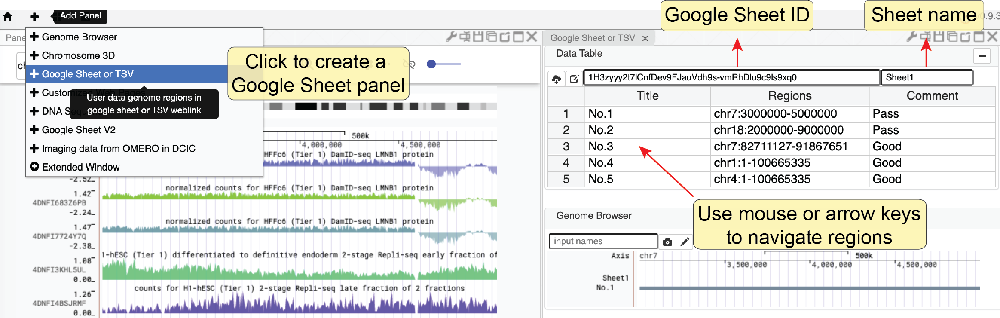

    Use the Goolge Sheet web component to explore region of interest

Fetch DNA sequence
==================

We created a web component to allow users to get the DNA sequence of the currently viewed region. 
It can only show the DNA sequence if the region's length does not exceed 10000 base pairs. 
Notably, when multiple regions are being viewed, this tool will show the DNA sequence of each region separately.

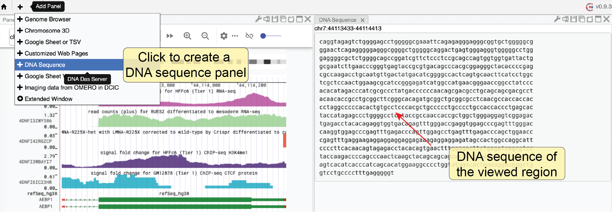

    Fetch the DNA sequence of the currently viewed region (< 10000bp)

4DN DCIC imging data
====================

The 4DN Data Coordination and Integration Center (DCIC) currently hosts abundant imaging data using an OMERO server. 
We have parsed the meta-information of those imaging data and stored that information if an image is labeled to specific genomic coordinates (e.g., DNA FISH data).
In this web component, each track represents one imaging experiment. 
The red bars on top of a track indicate the target of each experiment such as the genomic region targeted by FISH probes. 
Different images taken in one experiment are shown as a list of clickable thumbnails. 
You can view the raw image on the OMERO.iviwer by clicking the thumbnail or explore the details of this data on the DCIC website by clicking the number icon associated with each image.

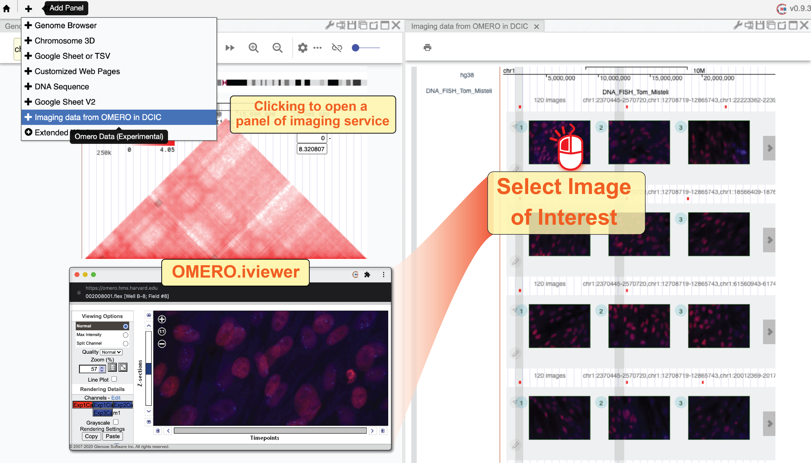

    Use the DCIC image web component to view imaging hosted on the 4DN DCIC data portal
