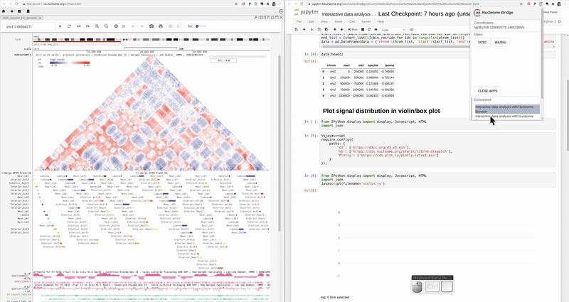
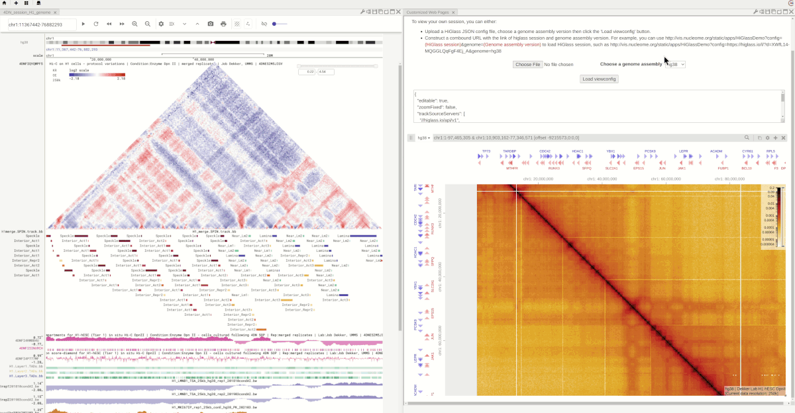

======================
Link to customized app
======================

This page is still under development. Please wait for more information

Link to a customized webpage
============================

You can create a customized webpage and use the nb-dispatch javascript library and Nucleome Bridge web browser extension to link `Nucleome Browser <https://chrome.google.com/webstore/detail/nucleome-bridge/djcdicpaejhpgncicoglfckiappkoeof>`_ with your webpages.
Examples of customized web pages we created are shown `here <https://vis.nucleome.org/static/demos>`_

Link to DCIC Jupyter notebook
=============================

The following example shows that it is possible to link the Nucleome Browser with the Jupyter notebook server provided by the 4DN DCIC. Users can process the raw 4DN data in the Jupyter notebook. Once users highlight some regions on the Nucleome Browser, the violin plot on the right will only show the genomic regions overlapping with the highlighted region on the Nucleome Browser.  

    Interactive data exploration in 4DN DCIC Jupyter notebook

Link to HiGlass
===============

We also create a customized web page to link the HiGlass session with Nucleome Browser. You can open a **Customized web page** panel in the Nucleome Browser can put this `link (http://vis.nucleome.org/static/apps/higlass/) <http://vis.nucleome.org/static/apps/higlass>`_ in the URL box. You should see a HiGlass viewer in the panel.

When you navigate on the genome browser, the HiGlass viewer will also update its genomic coordinates accordingly. The synchronized highlight is also supported as shown in the animation below.

.. figure:: img/figures_chapter_8/NB_linkto_HiGlass.gif
    :align: center
    :figwidth: 720px

    Use customized web page to link HiGlass with Nucleome Browser

You can also upload a HiGlass config JSON file. For example, the animation below shows that you can upload a config file downloaded from the 4DN DCIC web portal. It will then link with Nucleome Browser with synchronized navigation and highlight.

.. figure:: img/figures_chapter_8/NB_load_DCIC_higlass.gif
    :align: center
    :figwidth: 720px

    You can upload your HiGlass configuration file to view your HiGlass session

Another way to restore an existing HiGlass session is to construct a compound URL in the input URL box of this panel. For example, you can use `http://vis.nucleome.org/static/apps/HiGlassDemo?config=`<HiGlass session>`&genome=`<Genome assembly version>` to load a HiGlass session. You should replace <HiGlass session> with the HiGlass share link and replace <Genome assembly versio> with supported genome version (e.g., hg19, hg38, mm10, etc.). The advantage of this method is that when you share the Nucleome Browser session with others the shared session also includes the HiGlass session link. The following example shows that you can also create two customized pages and show different HiGlass sessions in each panel. The flexible layout feature of Nucleome Browser thus provides a convenient way to compare different datasets even if the datasets are hosted in external data portals such as different HiGlass servers.

    You can also view the HiGlass session by attaching the HiGlass session link as parameters in the URL

