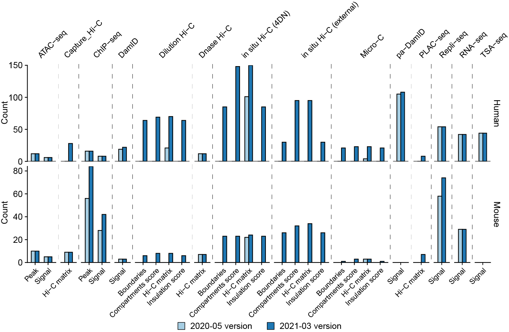
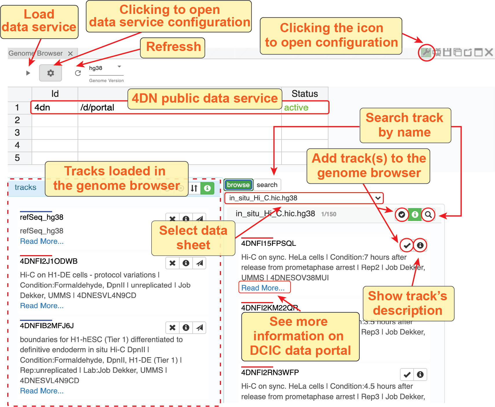

=================
Use 4DN DCIC data
=================

Overview
========

4D Nucleome Data Coordination and Integration Center (DCIC) is the data portal for hosting raw and processed data from the 4D Nucleome Network. We have downloaded public data hosted by DCIC and create a local data server in Nucleome Browser for public usage. The figure below shows the number of tracks (processed data) hosted by Nucleome Browser after the upgrade in March 2020. We will continue to update our data server to include more processed data generated by DCIC.

    Number of tracks hosted by Nucleome Browser in 2020 and the lasted version (March 2020)

Use 4DN public data
===================

Add tracks
----------

We added the 4DN public data as a default data service in the Nucleome Browser. You can see these data in the track configuration panel by clicking the ``panel-configuration button`` (|panel-config|) on the top-right corner of the panel or the ``configuration button`` (|gb-config|) in the genome browser toolbar. The figure below explains the interface of track configuration. 

.. |gb-config| image:: img/other/icon/icon-genome-config.png
    :height: 14px

.. |panel-config| image:: img/other/icon/icon-panel-config_v2.png
    :height: 14px

    
    Use track configuration interface to add public 4DN data to genome browser panel

Notably, we have manually curated track names to make them easier to understand. You can click the exclamation button to reveal them. There is also a ``Read More`` link that can link you to the DCIC website showing more metadata about each track. If one experiment has multiple processed data, we add the experiment id to the track name. You can copy this experiment id and use the global search tool to search all tracks associated with this experiment. The following animation shows an example to add all processed data from a Hi-C experiment.

.. figure:: img/tutorial/GIF/NB_4DN_add_track.gif
    :align: center
    :figwidth: 640px
    
    Add processed data from one Hi-C experiment

Config tracks
-------------

The track id (file id) from 4DN is just a combination of letters and numbers. To better distinguish different tracks, you can give an alias to a track. You can also click the long track name to open its' metadata link on the DCIC web portal

.. figure:: img/tutorial/GIF/NB_4DN_track_usage.gif
    :align: center
    :figwidth: 640px

    
    Give an alias to track

Explore microscopy data
=======================

The DCIC data portal also hosts `microscopy data <https://data.4dnucleome.org/microscopy-data-overview>`_. Some microscopy data can be associated with genomic loci such as DNA probes. To view these data in Nucleome Browser, you can open a panel named ``Imaging data from OMERO in DCIC``. A track of images will appear if probes are located at the currently viewing region. For example, in data from Finn et al, each track represents images collected from one experiment. The red bars in the track indicate the targeting regions of probes. You can click the ``highlight`` button on the left of the track to highlight these regions. The arrows on each side of the track can help to reveal different images. You can also go to a specific image by clicking the ``message`` button on the left of each track. Finally, you can click the thumbnail to view the raw imaging file in the OMERO.iviewer hosted by the DCIC team.

.. figure:: img/tutorial/GIF/4DN_DCIC_OMERO.gif
    :align: center
    :figwidth: 640px    

    Nucleome Browser supports interactively explore imaging hosted in the DCIC data portal
