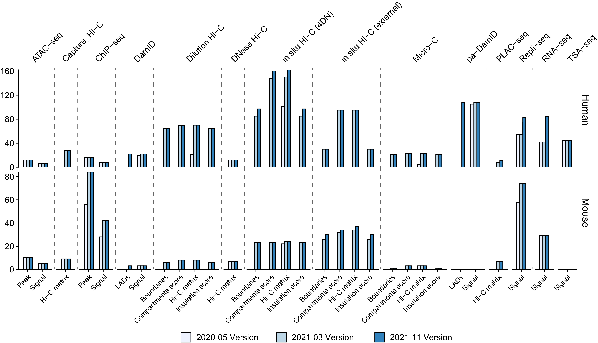

====================
Browse 4DN DCIC data
====================

Overview
========

4D Nucleome Data Coordination and Integration Center (DCIC) is the data portal for hosting raw and processed data from the 4D Nucleome Network. We have downloaded public data hosted by DCIC and created a local data server in Nucleome Browser for public usage. The figure below shows the number of tracks (processed data) hosted by Nucleome Browser since the first release in March 2021. We will continue to update our data server to include more processed data generated by DCIC. Nucleome Browser currently hosts 2,292 genomic tracks and 732 image datasets.

    Number of tracks hosted by Nucleome Browser in 2020 and the lasted version (November 2021)

Use 4DN public data
===================

Add tracks
----------

We have added 4DN public data to the default list of data services in the Nucleome Browser. You can see these data in the track configuration panel by clicking the ``panel-configuration button`` (|panel-config|) on the top-right corner of the panel or clicking the ``configuration button`` (|gb-config|) in the genome browser toolbar. The figure below explains the interface of track configuration. If you do not see 4DN public data service you can manually add it by typing /d/portal in the URI column and clicking the refresh button to load it.

.. |gb-config| image:: img/other/icon/icon-genome-config.png
    :height: 14px

.. |panel-config| image:: img/other/icon/icon-panel-config_v2.png
    :height: 14px

.. figure:: img/tutorial/tutorial_4DN_track_config.png
    :align: center
    :figwidth: 640px
    
    Use track configuration interface to add public 4DN data to genome browser panel

Notably, we have manually curated track names to make them easier to understand. You can click the exclamation button to reveal the curated meta-information of a track. There is also a ``Read More`` link that can lead you to the DCIC link of a track. If one experiment has multiple processed data, we add its experiment id at the end of the track name. You can copy this experiment id and use the global search tool to search all tracks associated with this experiment. The following animation shows an example to add all processed data from a Hi-C experiment.

.. figure:: img/tutorial/GIF/NB_4DN_add_track.gif
    :align: center
    :figwidth: 640px
    
    Add processed data from one Hi-C experiment

Config tracks
-------------

The track id (file accession number) from 4DN is a combination of letters and numbers. To better distinguish different tracks, you can assign an alias to a track. You can also click the long track name to open its link on the DCIC web portal.

.. figure:: img/tutorial/GIF/NB_4DN_track_usage_1.8x.gif
    :align: center
    :figwidth: 640px

    Click long label of a track open its metadata link on the DCIC web site. You can also give an alias to a track

Explore imaging data
====================

The DCIC data portal also hosts `imaging data <https://data.4dnucleome.org/microscopy-data-overview>`_. Some imaging data contain meta-information related to genomic loci on the genome such as the targeting regions of DNA probes. To view these imaging data in Nucleome Browser, you can open a panel named ``Imaging data from OMERO in DCIC``. A track of images will appear if probes are located in the current region. For example, in data from Finn et al, each track represents images collected from one experiment. The red bars in the imaging track indicate the targeting regions of probes. You can click the ``highlight`` button on the left of the track to highlight these regions. The arrows on each side of the track can be used to browse different images. You can also jump to a specific image by clicking the ``message`` button on the left of each track. Finally, you can click the thumbnail to view the raw imaging data in an OMERO.iviewer hosted by the DCIC team.

.. figure:: img/tutorial/GIF/4DN_DCIC_OMERO.gif
    :align: center
    :figwidth: 640px    

    Nucleome Browser supports interactively explore imaging data hosted in the DCIC data portal
