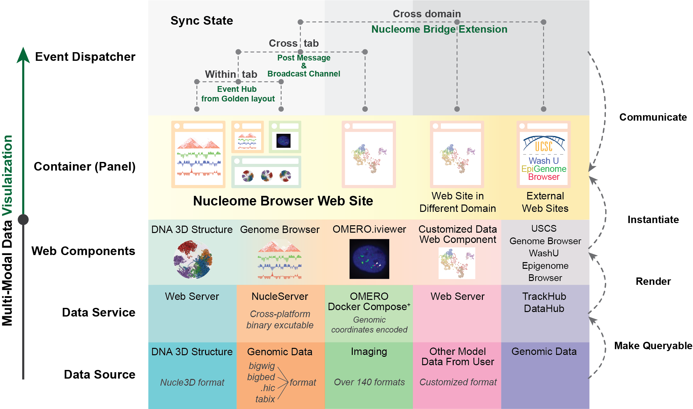
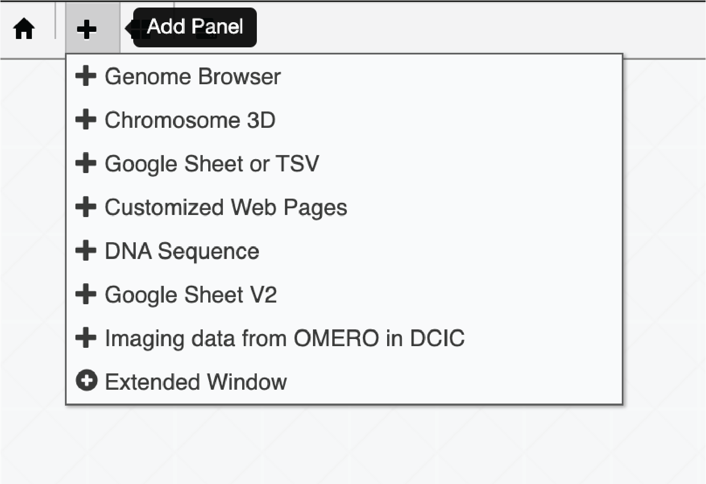
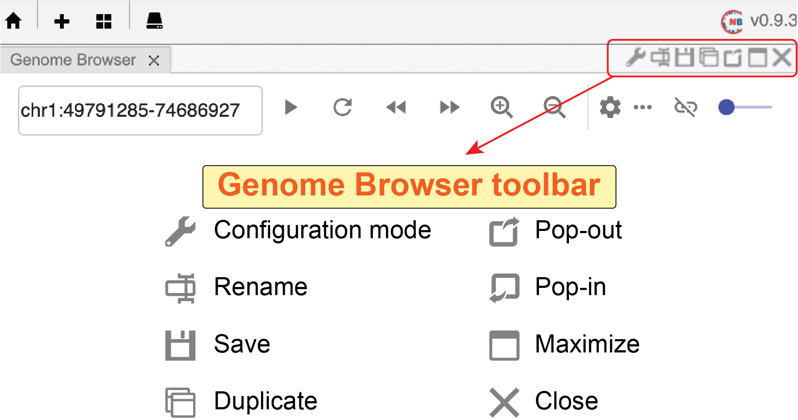
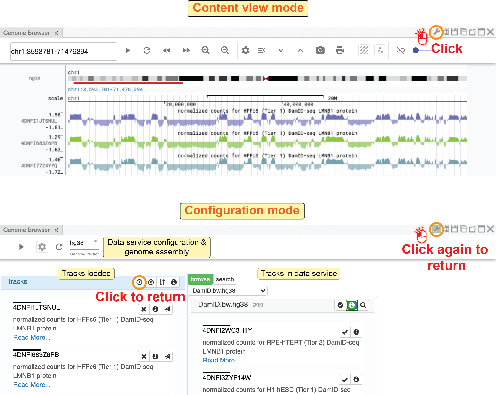
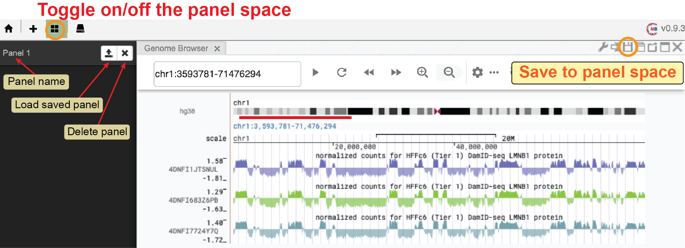
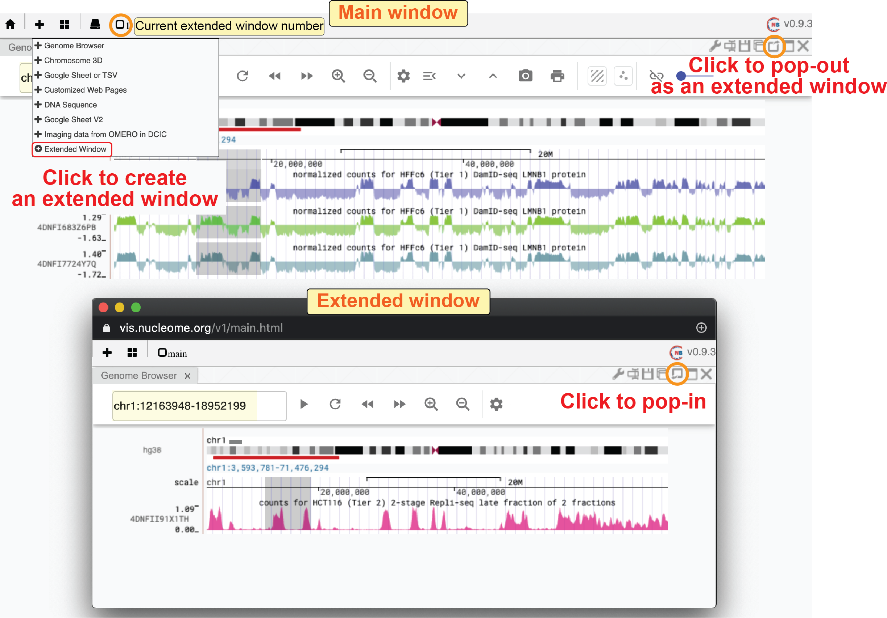
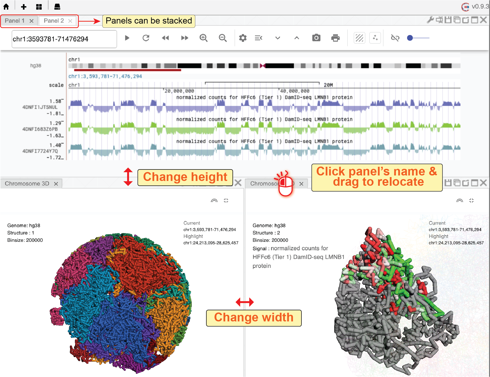

==============================
Panel-container system
==============================

Overview
========

Nucleome Browser adopts the concept of modular design in its architecture. 
First, we created a series of web components (i.e., customized HTML elements) that can be flexibly arranged and customized by the user (i.e., composable and configurable) and that offer synchronized operations for integrative visualization of heterogeneous datasets or different views from the same data modality. 
Each web component is designed to visualize a specific type of data (e.g., genomic data, 3D genome structure models, or imaging data).
Next, we standardized different web components into web containers (web panels) with the same interface such that these different web components can **communicate** with each other with an adaptive communication mechanism (see below).
Users can combine multiple components/panels into tabs of the web browser in a flexible and user-friendly manner. 
Currently, two types of messages triggered by a user can transmit across web components, including 1) current viewed genomic regions; 2) highlighted genomic regions. 
Nucleome Browser supports messages transmission across web panels in the same web tab, across web tabs in the same domain, or across websites in different domains (e.g., UCSC Genome Browser) through a web browser extension named Nucleome Bridge. 
This versatile and powerful feature is achieved through a hierarchical adaptive communication mechanism. 
To summarize, Nucleome Browser is the first platform that supports this multi-domain and multi-channel interactive visualization, which greatly enhances heterogeneous and multimodal data exploration.

    The overall design of Nucleome Browser: from data service to synchronization of web components. This diagram shows the key concepts as well as major functionalities introduced in Nucleome Browser to overcome the major challenges of multimodal data visualization for 4D Nucleome research. Each row of the diagram represents a layer of data processing step from bottom to top. Six columns refer to three main modalities (genomics, imaging, and 3D genome structure model) currently represented in Nucleome Browser, customized data type, external data portal, and Python Jupyter Notebook. From bottom to top, it shows the procedure of using data service to process different data types and various front-end to render and visualize these data types. The top two rows are the major components of the adaptive communication system. Web components are represented by composable web panels. We use different web APIs to allow communication between web components in different configurations. Importantly, we also developed Nucleome Bridge web browser extension to communicate with external web-based data portals.

What is a panel?
================

You can consider different web panels as different Lego bricks such that they have distinct functionalities while still possessing the ability to **communicate** with each other.
In Nucleome Browser, web panels are all contained in a panel-container system, allowing displays from web panels to synchronize with each other.
Next, we will formally introduce some basic operations of web panels, including the creation of a new web panel, duplication of existing web panels, a panel-space widget to conveniently organize web panels, .etc.

Create a new panel
==================

Creating a new panel is easy.
When you mouse over the ``plus`` button (|top-plus|) on the top menu bar, a drop-down menu will appear showing all the different types of web component/panel that you can create.

    Users can create a new panel using the top menu bar

.. |top-plus| image:: img/other/icon/icon-top-plus.png
    :height: 14px

Basic operations
================

A panel is like a sub-tab in one browser tab.
You can configure each panel using the configuration toolbar located on the top-right of its frame.
:numref:`panel_menu` shows the function of each button on the panel's configuration toolbar.

    Panel configuration toolbar on the top-right corner

**Configuration mode of a panel**

Clicking the ``configuration`` button (|panel-config|), you will see the configuration interface of this panel if that panel has the configuration mode. 
In the configuration mode (the configuration button will turn to green color), you can go back to the visualization mode by clicking the button again.

    Toggle Configuration / Visualization mode 

.. |panel-config| image:: img/other/icon/icon-panel-config_v2.png
    :height: 14px

**Rename a panel**

Clicking the ``rename`` button (|panel-rename|), you will see a dialog popping out.
You can then change the title of this panel.
This title will also be the default name when you save this panel to the panel space.

**Save a panel to panel space**

Clicking the ``save`` button (|panel-save|), you can save the current panel into the panel space, which is hosted locally in the web browser’s IndexedDB.
To view saved panels in the panel space, you can click the panel space button (|panel-space|) on the top menu bar.
A window of panel space will be shown on the left side of the panel.
Users can load panels saved in the panel space to the current web tab using the upload button (|panel-upload|) or delete saved panels using buttons next to each panel using the delete button (|panel-delete|).
Panel space works similarly to the bookmarks of the web browser, allowing users to easily re-use and compose previous panels from different sessions.
Notably, since panels in the panel space are saved into the web browser's IndexedDB, you will not find them if you use another computer.

    
    Save a panel to Panel Space

**Duplicate a panel**

Clicking the ``duplication`` button (|panel-duplicate|) of a panel, you can duplicate this panel in the same web tab.
This feature is useful when you want to create a similar panel by making small changes to an existing panel.
It is also quite useful if you can create a similar genome browser panel with different zooming factors.

.. |panel-duplicate| image:: img/other/icon/icon-panel-duplicate_v2.png
    :height: 14px

**Pop-out and pop-in a panel**

Nucleome Browser allows users to create panels in different web tabs.
Notably, panels in different web tabs are all synchronized with each other.
However, there is the main tab to which all the other extended panels are attached.
If you close the main tab, all the extended panels will also be closed.
There are two ways to create an extended panel.
First, you can click the ``pop-out`` button (|panel-pop-out|) to convert a panel into an individual web window.
Once a panel becomes a pop-out window, the ``pop-out`` button (|panel-pop-out|) will turn into a ``pop-in`` button (|panel-pop-in|).
Clicking the pop-in button, the pop-out panel will be added back to the main tab.
In the second method, you can create an extended panel by clicking the ``Extended Window`` button (|panel-extra|) in the drop-down menu of the ``plus`` button on the top menu bar.

    Pop-out a panel into an extended window

**Maximize a panel / Back to standard view**

Clicking the ``maximization`` button (|panel-max|) of a panel, you will see the panel taking the full width of the current web browser. 
You can click the ``minimization`` button (|panel-min|) of that panel to change back to the compact layout.

**Close a panel**

You can close a panel by clicking the ``close`` button (|panel-close|).

Flexible layout
===============

Nucleome Browser uses `Golden Layout <https://golden-layout.com>`_ to control the layout of panels in the same web tab.
Users can move a panel to the desired position by clicking the title of a panel, holding the mouse, and dragging it to different positions of the web tab.
The system will automatically adjust the height or the width of the panel (usually by horizontally splitting or vertically splitting panels) and show the preview of that panel as a grey box.
You can arrange panels side-by-side or stack one on top of other panels.
To resize a panel, you can move the mouse to the boundary of a panel.
The mouse will turn into a resizing form when it close to the boundary of a panel. 
You can then click and hold the mouse to change the height or width of a panel.

    Nucleome Browser support a flexible layout to arrange multiple panels
