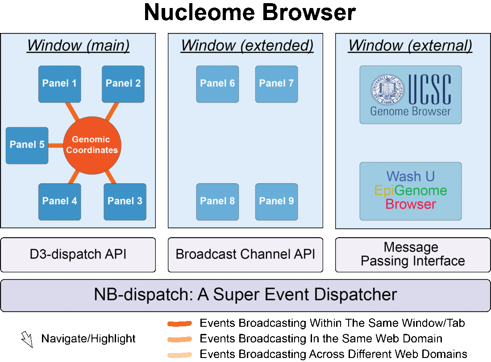
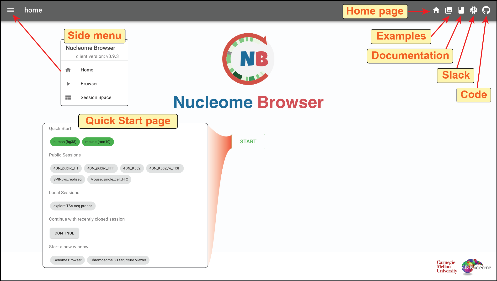

============================================
Nucleome Browser: A Multimodel Visualization for 4DN Nucleome
============================================

|nb_link| is a multimodal, interactive data visualization and exploration platform to integrate genomic, imaging, and 3D genome structure data.
It can empower investigators to fully utilize heterogeneous datasets to formulate hypotheses and gain new insights into the interplay among different constituents in the nucleus and their roles in 3D genome structure and function.

.. |nb_link| raw:: html

    <a href="https://vis.nucleome.org" target="_blank">Nucleome Browser</a>
 

    Nucleome Browser consists of multiple comfigurable, communicable, and composable web components (panels) for visualization multi-modal data. Operation in any panel will be synchronized to all connected panels and external web sites such as the UCSC Genome Browser and the WashU Epigenome Browser.

   
Quick Start
~~~~~~~~~~~

To explore Nucleome Browser, go to the main portal of Nucleome Browser at `https://vis.nucleome.org <https://vis.nucleome.org>`_.
You can find all the resources related to the platform including examples of pre-configured browser sessions, documentation, a Slack channel for discussion and reporting issues, etc.

    
    Home page of the Nucleome Browser

Clicking the ``Examples`` button (|home_example|) on the top-right toolbar on the home page, you will see a series of thumbnails of browser sessions. 
You can explore those examples by clicking the ``enter`` button (|example_enter|). 
For example, in the **Multi-modal integrative analysis** example shown below, you will see a browser session illustrating a comparison of the 3D nuclear organization between K562 and H1 cells. 

Two genome browser panels on the left show various genomic data between K562 and H1, including Hi-C contact matrices, TSA-seq, and DamID tracks mapping to multiple nuclear bodies (e.g., nuclear speckles, nuclear lamina, and nucleolus), and replication-timing profiles. 
On the right, there are two 3D structure panels illustrating 3D structur models with color representing TSA-seq signals on Lamina B1 in H1 and K562, respectively.
It is also possible to explore imaging data using the Nucleome Browser.
In the middle genome browser panel for K562, you can see an image track showing DNA FISH data. 
The target region of each probe is represented by a blue bar.
Clicking on one image, a OMERO.iviewer window will pop-out allowing you to further explore the image using the OMERO.iviewer tool.

.. figure:: img/figures_chapter_1/ch1_example.png
    :align: center
    :figwidth: 640px

    Nucleome Browser faciliates interactive exploration of multi-modal data

.. toctree::
    :hidden:
    :glob: 
    
    design
    components
    plugin
    session
    data_service
    nb_dispatch_api

.. toctree::
    :hidden:
    :glob:
    :titlesonly:

