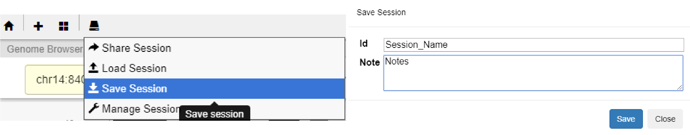
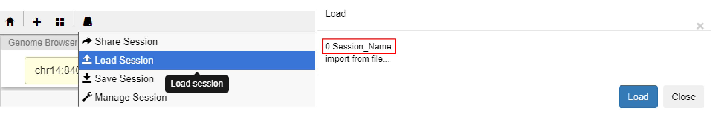
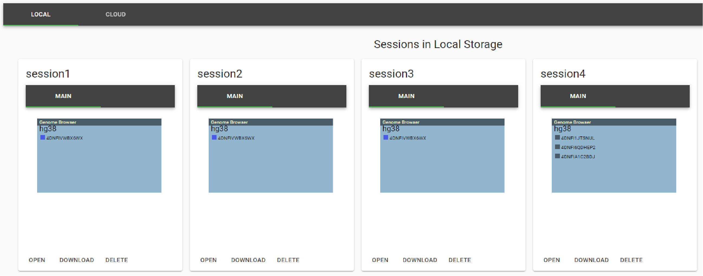
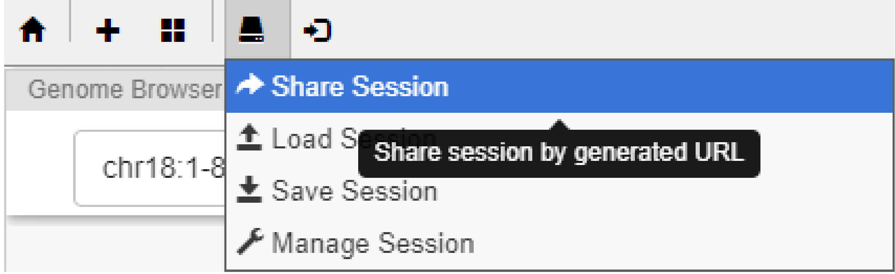

==================
Session Management
==================

Nucleome Browser provides multiple convenient tools to help users to restore previous browsing panels and their configurations.
First, we provide a session management tool to help users to manage multiple sessions of saved views of Nucleome Browser.
Each session contains the layout of panels in a web tab, configurations of tracks in each panel, and information about custom data loaded from the local data server.
You can use saved sessions as a future reference or share them with your colleagues.
We also provide a panel space widget to manage individual panels.
It helps users to quickly combine panels saved in the panel space and produce a new visualization layout.

Create a session to local
=========================

After you are satisfied with the current browsing view of Nucleome Browser, simply click the button of session tool on the top navigation bar. 
Click the ``Save Session`` button in the pulldown menu.

In the pop-out dialog box, fill in the name of the session in the Id box and add the description of this session in the Note box. 
A named session is saved in the web browser's local storage of your computer after you click the Save button. 

    
    Create a session in local storage

Open a saved session
====================

To load a saved session in local storage, click the button of the session tool on the top navigation bar. 
Click the ``Load Session`` button on the pulldown menu.
Select a session and click it to open it in a new browser tab.

    Open a saved local session

Session management tool
=======================

You can also use the sessions management tool to manipulate sessions saved in the local storage of your web browser or cloud by Google Sheet.
Click the button of the session tool on the top navigation bar and click the ``Manage Session`` button in the pulldown menu.
All the sessions save in your local machine will show in a new browser tab.
:numref:`manage_session` shows an example of the view of the session management tool.

Each box represents a save session with session name, genome assembly version, and layout of panels (including panel name and names of tracks).
You can click the download button to download the session setting file and save it somewhere else or email it to others.
You can also open a saved session or delete it from local storage.

    Mage saved sessions using the session tool

Share session
=============

There are two ways to share sessions with others. 
The first method is to send them (e.g., via email) the session setting file. 
Session setting files from the local machine can be downloaded using the Session management tool (see Session above). 
The second method is to send the session URL to others. 
To get the session URL, click the button of the session tool on the top navigation bar.
In the pulldown menu, click the ``Share Session`` button.
In the pop-out dialog box, copy the session URL into the clipboard, and share it with others.

    Share a session with others using session URL
