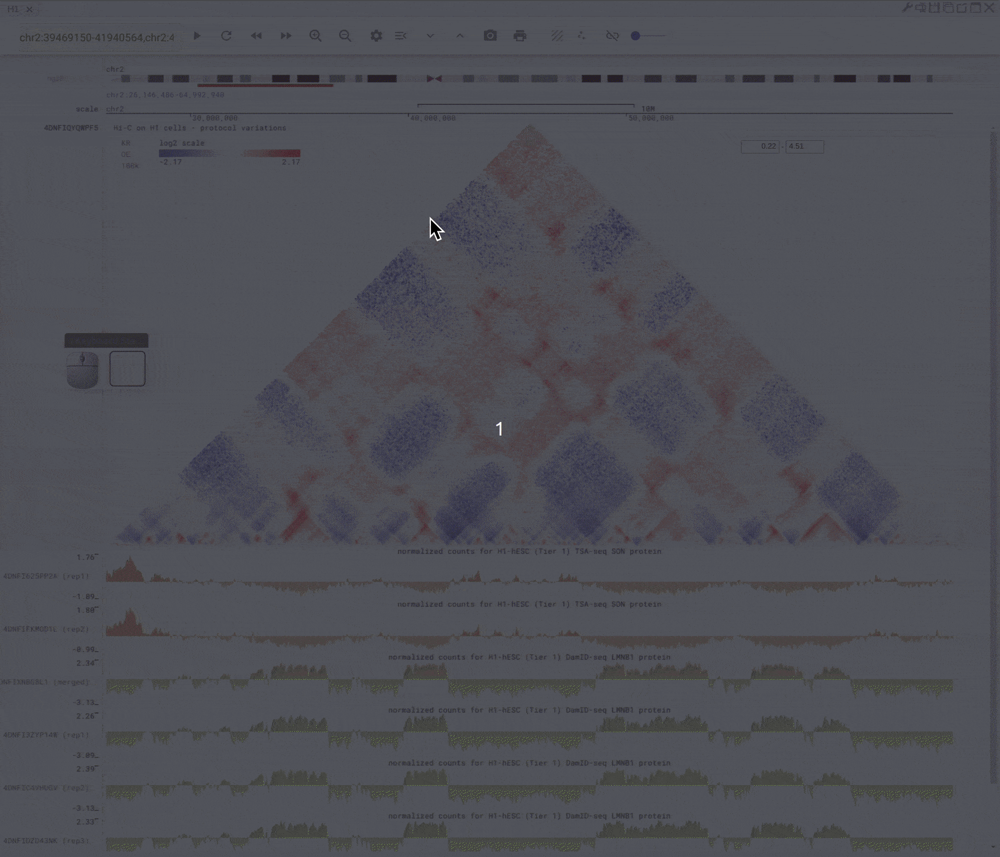
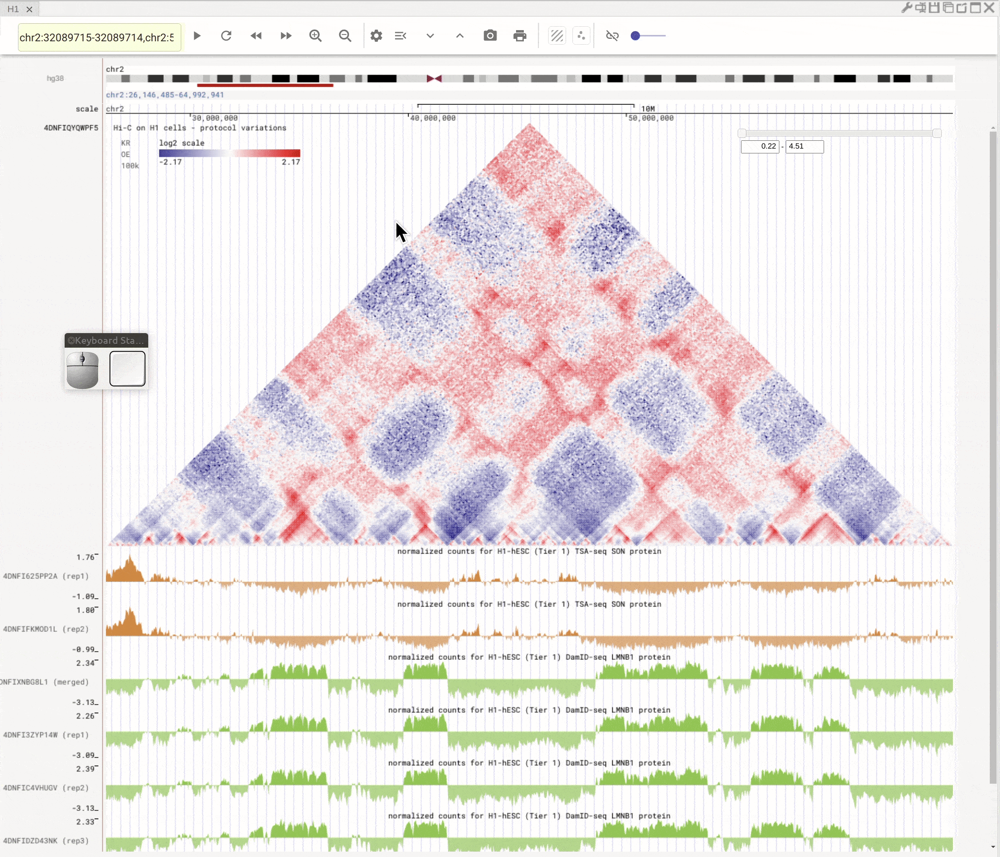
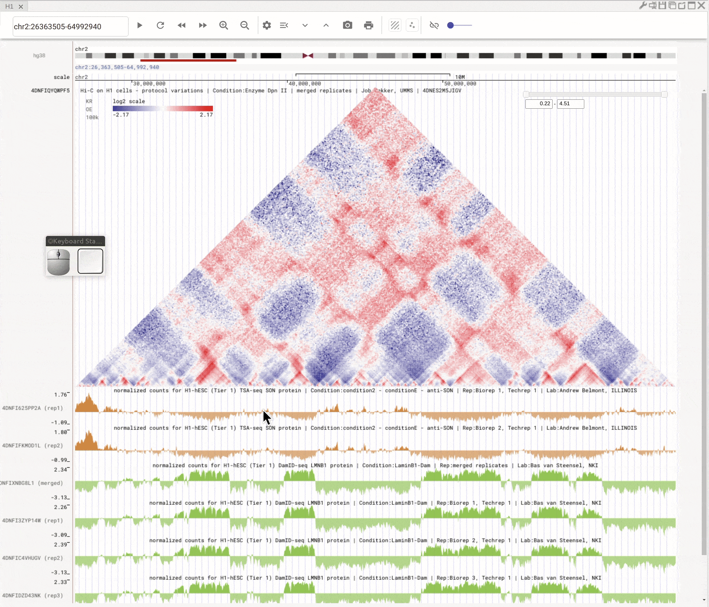
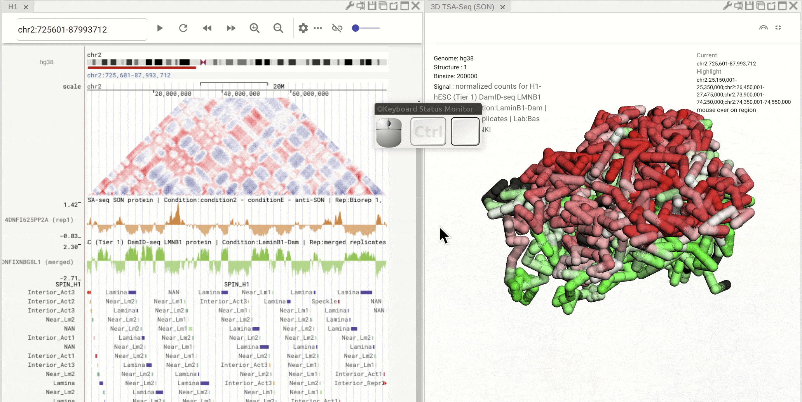
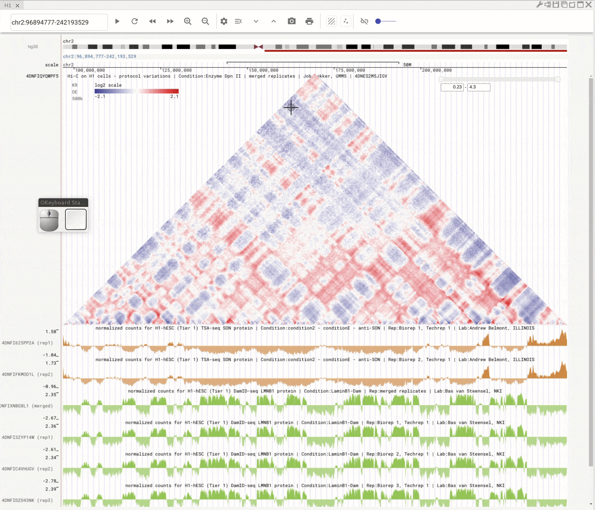
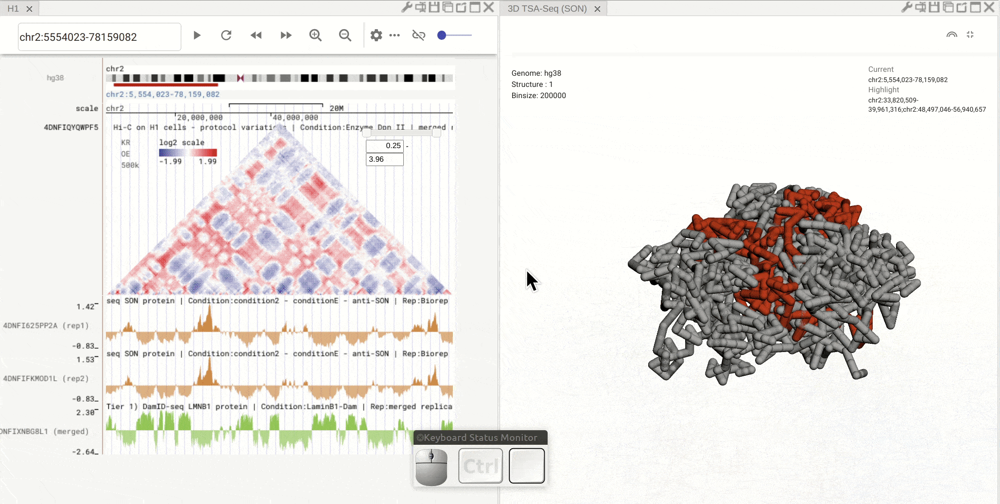
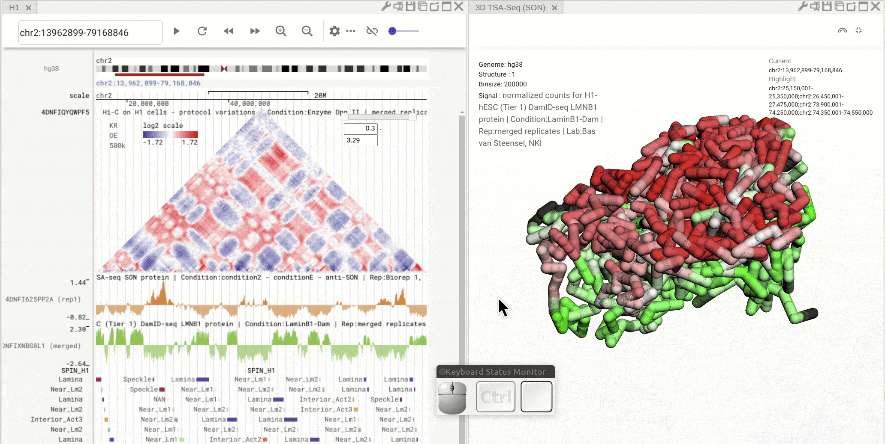
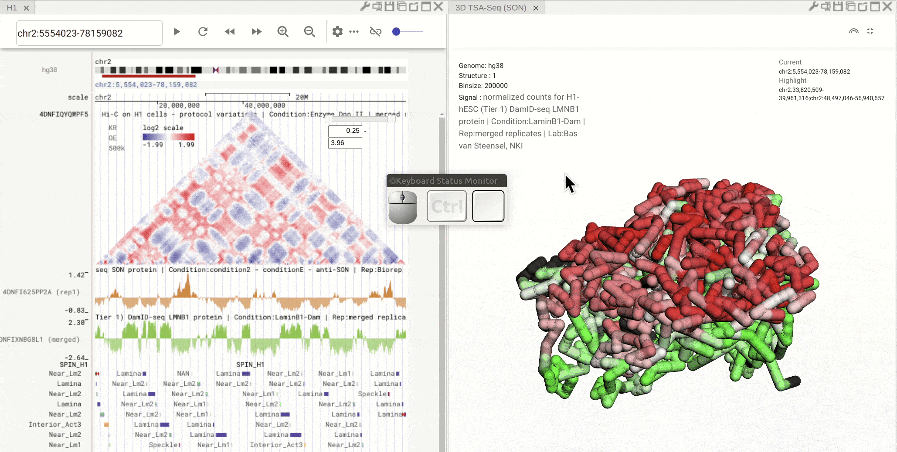

===========
Tutorial
===========

Overview
========

This tutorial demonstrates several basic and useful features in Nucleome Browser. Note that there are a lot of GIF file in this page. We recommend you to view these examples using computers rather than cell phones. 

Basic operations
================

Create a new panel
--------------------

When the mouse hovers on the ``plus`` button (|top-plus|), you can choose to create a panel from the drop-down menu. You can also duplicate a panel by clicking the ``duplication`` button (|panel-duplicate|) in the configuration toolbar located on the top-right of the panel.

.. figure:: img/tutorial/GIF/NB_create_a_new_panel_compress.gif
    :align: center
    :figwidth: 640px

    Create a new panel

Flexible layout
---------------

Nucleome Browser supports flexibly adjust the composition of panels. You can drag a panel to a different position by clicking the title of the panel, holding the mouse, and dragging it to the desired location. A grey box will indicate the final view of the panel. You can release the mouse to confirm it. Panels can also stack on each other if you drag a panel to another panel's title region. The mouse will turn into a re-size tool when you hover on the boundary of panels. You can drag it to adjust the height or width of a panel.

.. figure:: img/tutorial/GIF/NB_flexible_layout_compress.gif
    :align: center
    :figwidth: 640px

    Nucleome Browser support flexible layout to arrange multiple panels

Navigate the genome using nagivation buttons
--------------------------------------------

You can use navigation buttons to move forward/backward on the chromosome or zoom-in/-out.

    
    Use navigation button to move along the genome

Navigate the genome using ideogram
----------------------------------

To move to different regions on the same chromosome, you can also use the mouse to brush the ideogram of chromosome on the top. You can further adjust the brushed region using the left-button of the mouse or zoom into the brushed region by right-clicking the mouse. 

    
    Brush on the ideogram for quick nagivation on the chromosome

Left-click to highlight & right-click to zoom-in
------------------------------------------------

Use the left button of the mouse to highlight on 1D or 2D genomic tracks. You can further move the highlighted region by dragging the highlighted region. Use right-click to zoom-into the highlighted region(s). 

    
    Highlight on 1D and 2D genomic tracks using mouse left button. Right click the highlighted region to zoom-into

Click annotation to highlight multiple regions
----------------------------------------------

You can click a region in the bigBed track to highlight this region. If this region has a name (defined in the fourth column of the bed format), all the regions with the same name will be highlighted. Highlighted regions will synchronize across all connected panels. 

    
    Click on one region on the bed track. Other regions with the same annotation (name) will be highlighted

Interactive scatterplot tool
----------------------------

You can open the scatterplot tool by clicking the ``scatterplot button`` (|gb-scatterplot|). Each dot represents a genomic region with X-/Y-axis represent signals from different genomic tracks. You can then use the mouse to select interests dots and visualize their locations on the genome browser. Highlight regions on the genomic tracks will also show as highlighted dots in the scatterplot tool.

    
    Use scaterplot tool to interactively explore genomic tracks

Panning, Rotating, and Zooming in/out on 3D structure
-----------------------------------------------------

Pan: Press the **Control** key and use the left button of the mouse to move.
Rotate: Click and hold the left button of the mouse to rotate the 3D strcuture.
Zoom-in/-out: Use the center mouse wheel to zoom-in or zoom-out.

.. figure:: img/tutorial/GIF/NB_3D_exploration_compress.gif
    :align: center
    :figwidth: 640px
    
    Use the mouse the manipulate 3D structure

Super-impose bigwig on 3D structure
-----------------------------------

First, open the configuration window of the genome browser panel and enable rendering color using bigwig by clicking the ``color-by-bigWig button`` (|color-bigwig|) in the 3D structure toolbar. Select a bigwig track from the genome browser panel and drag the track to the target box on the 3D structure panel. 

Click segment on the 3D structure to navigate
---------------------------------------------

Enable clickable operation on 3D structure by clicking the pencil symbol on the 3D structure toolbar (the button will become darker). Left-click the mouse on the 3D structure to navigate to that region.

    
    Use the mouse the manipulate 3D structure

Synchronized highlight between genome browser and 3D structure
--------------------------------------------------------------

Highlighted regions are synchronized between genome browser panel and 3D structure panel. 

    
    Use the mouse the manipulate 3D structure

Explore public 4DN data
=======================
